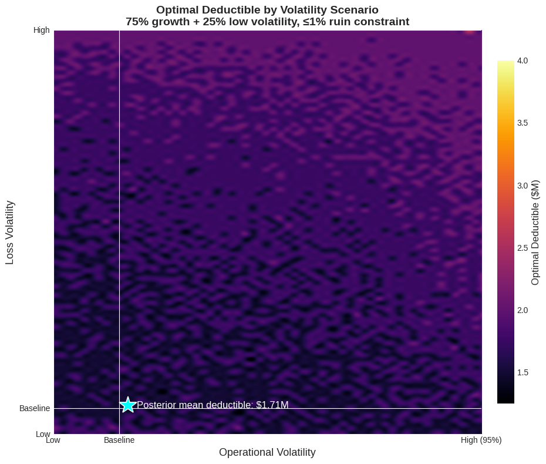
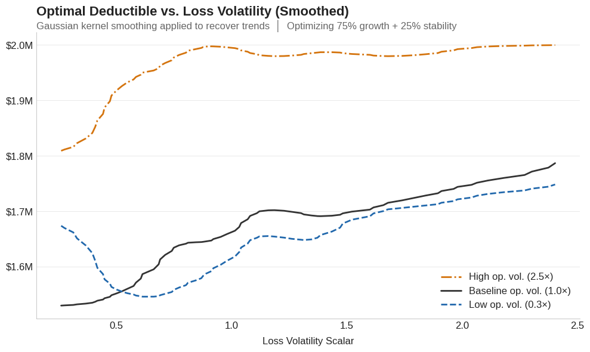
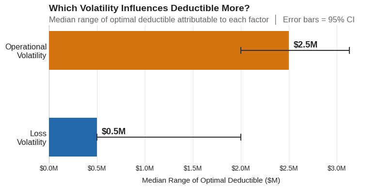

Every analysis in this series has treated volatility as a single dial: turn it up or down and watch the optimal deductible respond. The [volatility drag framework](volatility-drag-vs-premium-drag.md) decomposed growth into premium drag and the $\sigma^2/2$ penalty. The [insurance cliff](insurance-cliff-by-risk-profile.md) showed how tail risk creates threshold dynamics. The [severity estimation](severity-estimation.md) post revealed the shadow mean hiding in naive loss models.

But that's not how real companies experience risk. Loss severity fluctuates year to year. Revenue swings with market conditions. The question I hadn't addressed is **what happens to the optimal deductible when both sources of uncertainty vary at the same time?**

This post explores that two-dimensional space. The results surprised me.

## Two Volatilities, One Decision

A company's retained risk exposure depends on at least two independent sources of uncertainty:

**Loss volatility** captures how unpredictable the severity environment is. In a benign year, the catastrophic tail is thin and large losses are rare. In a stressed year, the same underlying exposure produces heavier tails and more frequent large claims. This isn't just a modeling abstraction: loss environments genuinely shift. A hardening liability market, an emerging risk like cyber, or a sudden increase in nuclear verdicts can all thicken the tail without changing anything about the company's operations.

**Operational volatility** captures revenue and earnings uncertainty. A manufacturing company with stable contracts and diversified customers has low operational volatility. A startup with concentrated revenue and seasonal demand has high operational volatility. This matters for insurance because the company's capacity to absorb retained losses depends on the cash flows available to replenish equity after a hit.

The deductible decision sits at the intersection of both. Retain too much when losses are volatile, and you take hits that compound against long-term growth. Retain too much when operations are volatile, and a bad revenue year coincides with a large loss to create a ruinous scenario. Retain too little in either case, and premium drag erodes the capital base.

## The Experiment

I modeled a middle-market manufacturing company (\$5M assets, \$10M revenue, 15% operating margin) across 100,000 joint volatility scenarios, sweeping both loss volatility and operational volatility using Sobol quasi-random sequences through inverse Gaussian priors. The Sobol sequences produced a smooth, space-filling coverage of the two-dimensional volatility surface rather than the clustering that simple random sampling would create.

At each scenario, the optimizer evaluated 58 deductible levels from \$10K to \$100M with a composite objective:

- **75% weight**: Maximize the time-average (ergodic) growth rate
- **25% weight**: Minimize log-growth volatility

subject to a hard constraint: **probability of ruin must not exceed 1%**.

The loss model uses the same three-component compound Poisson structure from earlier posts (attritional, large, and catastrophic claims), with a Pareto tail at $\alpha = 2.01$ for catastrophic losses, right at the boundary where variance is barely finite. The loss volatility scalar adjusts the coefficient of variation on the lognormal components and inverse-scales the Pareto $\alpha$, effectively thickening or thinning the tail. The operational volatility scalar multiplies the revenue standard deviation, widening or narrowing the range of earnings outcomes.

All 100,000 scenarios used common random numbers: identical pre-generated loss paths and revenue shocks, so every difference in outcome is attributable to the volatility assumptions and insurance structure alone.

The total computational sweep: 100,000 scenarios $\times$ 58 deductibles $\times$ 10,000 simulation paths = 58 billion evaluations, run across 48 parallel cores.

## The Heatmap


*Optimal deductible across 100,000 joint volatility scenarios. The x-axis sweeps operational volatility; the y-axis sweeps loss volatility. Color encodes the optimal deductible at each point. The mean optimal deductible across all scenarios is \$1.7M.*

The heatmap reveals three distinct regimes.

**The stable core.** Across most of the volatility space, where both loss and operational volatility are moderate, optimal deductibles cluster tightly around \1.25M-\$2.5M. The optimizer consistently finds this range as the balance point where premium savings and volatility costs offset each other. This is the regime where the [single-dimensional drag tradeoff](volatility-drag-vs-premium-drag.md) gives you a good answer.

**The high loss volatility edge.** As loss volatility increases (moving up the y-axis), optimal retention drifts *higher*, not lower, as I initially expected. When the tail thickens, insurers price accordingly. The premium for low deductibles rises with the severity environment, and the optimizer finds that paying the inflated premium creates more [drag](volatility-drag-vs-premium-drag.md) than retaining the additional risk. The effect is real but modest: roughly \$250K across the full loss volatility range.

**The extreme operational volatility corner.** At the far right of the heatmap, where operational volatility exceeds 4x baseline, something unexpected happens. Optimal deductibles spike sharply upward, reaching \$7.5M-\$15M. Why would a company with wildly uncertain revenue *increase* its risk retention?

## The Counterintuitive Result

The answer lies in the interaction between premium cost and the company's ability to pay it.

When operational volatility is extreme, the company's expected income is highly uncertain. Premium, however, is a fixed cost negotiated at the start of the period. In a bad revenue year, that fixed premium represents a much larger fraction of available cash flow, creating a liquidity-driven ruin pathway that has nothing to do with loss events.

At extreme operational volatility, the optimizer discovers that the premium drag from low deductibles becomes more dangerous than the loss volatility it protects against. The company is better off retaining more loss risk (which only materializes probabilistically) and preserving cash flow certainty (which matters every period). The tail protection from high excess layers remains essential, but the working layers become too expensive relative to the company's unstable earnings base.

This connects directly to how companies actually fail. As explored in the [insurance cliff analysis](insurance-cliff-by-risk-profile.md), bankruptcies are driven by singular extreme events, not attritional accumulation. When operational volatility is extreme, the most likely path to ruin shifts from "catastrophic loss exceeds insurance" to "fixed costs exceed available cash flow in a down year." The deductible responds accordingly.


*Kernel-smoothed optimal deductible as loss volatility increases, at three levels of operational volatility (0.3x, 1.0x, and 2.5x baseline). All three curves trend gently upward: higher loss volatility modestly increases optimal retention. But notice the vertical gap between curves: shifting from low to high operational volatility moves the deductible as much as the entire loss volatility range does.*

## It's Not the Losses, It's the Cash Flow

The [ergodic framework](insurance-limit-selection-through-ergodicity-when-the-99p9th-percentile-isnt-enough.md) penalizes variance through the $\sigma^2/2$ drag, and loss severity is the heavy-tailed contributor to that variance. Surely loss volatility would dominate the deductible decision.

The data says otherwise. Across all 100,000 scenarios, operational volatility shifts the optimal deductible by a median range of \$2.5M. Loss volatility shifts it by \$0.5M, a 5-to-1 ratio.


*Median range of optimal deductible attributable to each volatility factor, with 95% confidence intervals from bootstrap resampling across the 100,000 scenarios. Operational volatility drives 5x more variation in the optimal deductible than loss volatility.*

Why? Because retained losses are bounded above by the deductible itself. No matter how heavy the tail gets, the company only absorbs what falls below the retention, and everything above transfers to the insurer. Revenue shortfalls have no such ceiling. A bad year compresses the company's ability to absorb *any* retained loss and magnifies the burden of every fixed cost, including premium. The optimal deductible is more sensitive to the denominator (cash available to absorb losses) than to the numerator (expected retained loss size).

This doesn't mean loss characterization is irrelevant. The [severity estimation](severity-estimation.md) work still matters for setting the right insurance *limit*. But for the deductible decision specifically, understanding your cash flow volatility matters more, which is an unexpected finding.

## When the Ruin Constraint Binds

In the extreme corners (both loss and operational volatility elevated) the 1% ruin constraint starts to bind. The optimizer can no longer freely trade premium drag against volatility drag; it's forced into a retention level that keeps ruin probability below the threshold, even if that retention is suboptimal for growth.

This is where a single-objective optimizer would give you a dangerous answer. Without the ruin constraint, it might recommend a deductible that maximizes expected growth but exposes the company to a 3-5% probability of bankruptcy over the horizon. The constraint sacrifices some growth efficiency for survival, a trade most boards would happily make if they saw the numbers.

This connects to the broader theme of [risk measures](risk-measures-under-cat-tail.md): VaR at the 99.5th percentile sets a capital requirement, but it won't tell you whether your *insurance structure* is compatible with survival. The ergodic framework answers that question directly by simulating the full path dynamics.

## Practical Implications

**One-size-fits-all fails.** Optimal retention varies by 8x across the volatility space (\$1.25M to \$10M+). A company that sets its deductible once and forgets about it is betting that its volatility environment hasn't shifted. It probably has.

**Know your cash flow volatility.** This was the biggest surprise in the analysis: operational volatility drives the deductible decision 5x more than loss volatility in this experiment. Before your next renewal, understand how variable your earnings really are. A company with stable, contracted revenue can afford more retention than one with the same loss profile but cyclical or concentrated income. Your revenue forecast might matter more for deductible calibration than your actuary's severity analysis.

**Don't buy down deductibles for "stability."** Companies with uncertain earnings may be tempted to lower deductibles for predictability. The analysis says the opposite: when cash flow is volatile, the fixed cost of premium becomes a ruin driver in its own right. The better response is higher retention with strong excess protection: accept more working-layer risk to preserve cash flow, but keep the catastrophic layers firmly in place.

**Use the ruin constraint as a floor.** Growth optimization is the goal, but survival is the constraint. Any deductible recommendation should be checked against a ruin probability threshold calibrated to the company's risk appetite, the structural feature explored in the [insurance cliff](insurance-cliff-by-risk-profile.md) analysis.

## What This Doesn't Cover

This is a simplified experiment: a single aggregate loss process, deterministic operating margins, no multi-year feedback between large losses and future premium pricing. It doesn't capture correlated loss events or the inverse Gaussian priors' calibration to any specific industry. Those are real limitations.

For the foundational ergodic framework, see [Insurance Limit Selection Through Ergodicity](insurance-limit-selection-through-ergodicity-when-the-99p9th-percentile-isnt-enough.md). For how tail uncertainty propagates through insurance decisions, see [Stochasticizing Tail Risk](stochasticizing-tail-risk.md). For the single-dimensional drag tradeoff that this analysis extends, see [Volatility Drag vs Premium Drag](volatility-drag-vs-premium-drag.md).

## Download the Code

The full analysis, including Sobol sequence generation, inverse Gaussian priors, the 100,000-scenario volatility sweep, and the heatmap visualization, is available in the notebook:

- [Jupyter Notebook — Pareto Analysis with Loss and Volatility Sensitivity](https://github.com/AlexFiliakov/Ergodic-Insurance-Limits/blob/main/ergodic_insurance/notebooks/optimization/03_pareto_analysis_with_loss_and_vol_sens.ipynb)

**Install the Framework**:

```python
!pip install --user --upgrade --force-reinstall ergodic-insurance
```
