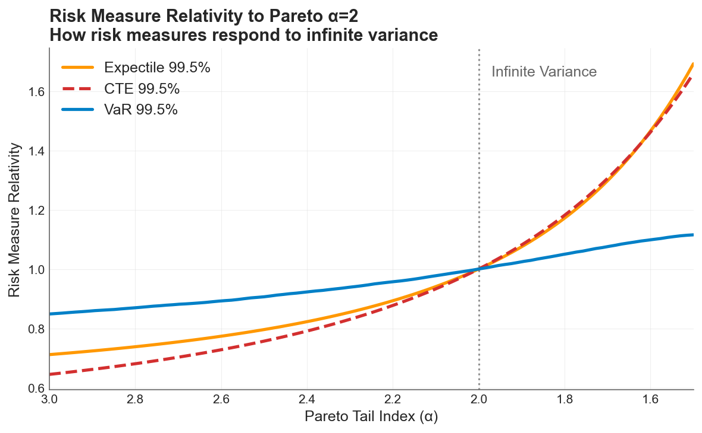

In the [previous post](risk-measures-under-cat-tail.md), I stressed a loss distribution until its variance became infinite and showed that VaR barely noticed while CTE more than doubled. The conclusion was clear: CTE captures the tail severity that drives [volatility drag](volatility-drag-vs-premium-drag.md), and VaR does not.

But CTE has a fatal flaw. You can't backtest it.

No consistent scoring function exists for ranking CTE forecasts (Gneiting, 2011). You can compute CTE from your model, set capital based on it, and have no principled way to verify whether the model was right after the fact. VaR, by contrast, has a clean backtest: count the exceedances and compare to the predicted frequency. But VaR isn't coherent. It can penalize diversification, violating one of the basic axioms of a sensible risk measure.

So we're stuck: one measure you can trust but not verify, and another you can verify but shouldn't fully trust.

Unless you use expectiles.

## What Is an Expectile?

An expectile at level $\tau$ is the unique value $e_\tau$ satisfying:

$$\tau \cdot E[(X - e_\tau)^+] = (1 - \tau) \cdot E[(e_\tau - X)^+]$$

In plain language: the expectile is the threshold where losses above it, weighted by $\tau$, balance against losses below it, weighted by $(1 - \tau)$. At $\tau = 0.5$, both sides get equal weight, and the expectile equals the mean. As $\tau$ approaches 1, the condition increasingly upweights the losses above the threshold, pushing it deep into the tail.

This definition looks technical, but the intuition is simple. A quantile (VaR) asks: *how often do losses exceed this threshold?* It counts exceedances. An expectile asks: *how severe are losses above this threshold relative to below?* It weighs magnitudes.

That single difference, frequency vs. magnitude, explains everything that follows.

At the 99.5% level, the expectile is the threshold where losses above it are roughly 200 times more consequential (in expectation) than losses below. A single massive loss pulls the expectile upward even if the number of exceedances hasn't changed. VaR would not move.

## The Experiment

I used the same three-component compound Poisson loss model from the [VaR vs CTE analysis](risk-measures-under-cat-tail.md): attritional, large, and catastrophic claims, with one million simulated annual loss scenarios at each of 100 Pareto tail index values from $\alpha = 3.0$ down to $\alpha = 1.5$.

The setup is identical: expected losses are held constant throughout by adjusting the Pareto scale parameter at each step ($x_m(\alpha) = \bar{X}_{cat} \cdot (\alpha - 1) / \alpha$). Nothing about the average loss changes. Only the shape of the catastrophic tail changes, concentrating more probability mass in extreme outcomes as $\alpha$ decreases.

The critical transition remains at $\alpha = 2$. Above this threshold, the Pareto distribution has finite variance. Below it, variance diverges to infinity while the mean stays well-defined.

All simulations used common random numbers (identical Poisson counts and uniform draws reused across $\alpha$ values) so every difference is attributable solely to the tail shape.

This time, I added the 99.5% expectile to the comparison alongside VaR and CTE at the same confidence level. The expectile's $\tau$ is not the same thing as the VaR or CTE percentile, so the choice was somewhat arbitrary, but I wanted to pick something to start building intuition.

## The Chart That Unifies the Story


*All three risk measures normalized to 1.0 at the infinite-variance boundary ($\alpha = 2$). VaR (blue) barely responds across the full sweep. CTE (red dashed) and the expectile (orange) track each other closely and are roughly 5x more responsive than VaR.*

Each measure is indexed to its own value at $\alpha = 2$, the boundary where variance ceases to exist:

- **VaR 99.5%** moves about 30% across the entire sweep. As a quantile, it asks whether the 99.5th data point shifted. It is structurally blind to mass redistributing above that point. A company can cross from finite to infinite variance, and VaR reports a modest adjustment.

- **The 99.5% Expectile** swings roughly 160%, from 0.7x at $\alpha = 3.0$ to 1.7x at $\alpha = 1.5$. Because the expectile weighs loss magnitudes, not just exceedance counts, a single massive realization pulls the metric upward. It detects the mass redistribution that VaR misses.

- **CTE 99.5%** tracks the expectile closely in this example. Both are approximately 5x more responsive than VaR. But this near-overlap is specific to the 99.5% confidence level and this particular loss model, and should not be seen as a general relationship.

The story from the [previous post](risk-measures-under-cat-tail.md) still holds: VaR is blind to the severity dimension of tail risk that drives volatility drag. But now we have a third option that matches CTE's sensitivity *and* can actually be verified after the fact.

## Why This Matters: Connection to the Two Drags

The [volatility drag vs premium drag framework](volatility-drag-vs-premium-drag.md) decomposes time-average growth into two opposing forces:

$$g \approx \mu_{\text{arith}} - \frac{\sigma^2}{2}$$

**Premium drag** reduces the arithmetic mean $\mu$ through the direct cost of insurance. **Volatility drag** penalizes growth through $\sigma^2/2$, the quadratic penalty that separates geometric from arithmetic compounding. The optimal deductible sits where the marginal premium savings from retaining more risk exactly equal the marginal volatility cost.

The risk measure you use to calibrate your insurance program determines whether you can see the force that matters most for long-term compounding.

Volatility drag is driven by the *magnitude* of retained losses. It is the size of the hits to equity, not just their frequency, that inflates $\sigma^2$ and penalizes compounding growth. VaR, as a pure quantile, is structurally blind to magnitude. It tells you how often losses exceed a threshold, but nothing about how bad they are when they do. Expectiles and CTE, by contrast, respond directly to loss severity in the tail.

When catastrophic tails thicken from $\alpha = 3.0$ to $\alpha = 1.5$, VaR grows 1.3x while expectiles grow roughly 2.5x. A risk manager relying on VaR would see capital requirements inch upward and conclude the program needs modest adjustment. The expectile reveals the actual exposure: tail severity has grown dramatically, and so has the volatility drag that compounds against the firm's long-term equity trajectory.

This is the [ergodic insight](insurance-limit-selection-through-ergodicity-when-the-99p9th-percentile-isnt-enough.md) applied to risk measurement. Companies don't operate across ensembles, they operate in time. Under multiplicative dynamics, a 50% loss followed by a 50% gain leaves you at 75%, not 100%. The risk measure that captures this compounding cost needs to be sensitive to how *deep* the trouble runs, not just how *often* it arrives.

## The Unique Property: Coherent and Backtestable

So why not just use CTE? Three properties matter for a production risk measure:

| Property | VaR | CTE | Expectile |
|---|:-:|:-:|:-:|
| **Coherent** (subadditive: doesn't penalize diversification) | ❌ | ✅ | ✅ |
| **Elicitable** (backtestable: has a consistent scoring function) | ✅ | ❌ | ✅ |
| **Tail-sensitive** (responds to loss magnitudes, not just frequency) | ❌ | ✅ | ✅ |

Expectiles are the only law-invariant risk measures that are simultaneously coherent and elicitable (Ziegel, 2016; Bellini & Bignozzi, 2015). A risk manager can set a coherent capital requirement *and* verify whether the model is calibrated after the fact. No other risk measure lets you do both.

This isn't just theoretical elegance. In practice, it means:

- **Capital adequacy**: Expectile-based capital requirements respect diversification. Merging two portfolios never increases the total capital requirement, unlike VaR where it sometimes can.

- **Model validation**: After each period, you can score your expectile forecast against realized losses using a consistent scoring function and determine whether your model was well-calibrated. With CTE, no such scoring function exists. You can compute the CTE after the fact, but you cannot rank competing CTE models in a statistically principled way.

- **Regulatory potential**: Solvency II is calibrated on VaR at 99.5%, which this analysis shows is structurally insensitive to the tail dynamics that drive [volatility drag](volatility-drag-vs-premium-drag.md). Expectiles offer a path to coherent, backtestable capital standards that actually respond to the risks they're meant to capture.

## Practical Implications

**If you're calibrating deductibles or limits:** The [optimal retention](volatility-drag-vs-premium-drag.md) depends on accurately measuring the variance that retained losses create. VaR-based estimates understate this variance, particularly for catastrophic distributions with $\alpha$ near or below 2. Expectiles capture the same severity information as CTE, with the added benefit that you can validate the model.

**If your tail shape is uncertain:** Historical data rarely contains enough extreme events to distinguish $\alpha = 2.5$ from $\alpha = 1.8$. But the expectile at 99.5% differs by roughly 1.5x between these two assumptions. That sensitivity cuts both ways: expectiles will tell you more about your tail risk than VaR will, but they also demand that you take [tail uncertainty](stochasticizing-tail-risk.md) seriously in your modeling.

**If you're building risk models for [the insurance cliff](insurance-cliff-by-risk-profile.md):** The cliff exists because small changes in tail coverage create disproportionate changes in ruin probability. Expectiles, by their sensitivity to tail magnitudes, provide a more honest signal of where you stand on that cliff than VaR does.

## The Open Question

The question I'm exploring next: **can an expectile constraint on losses reproduce the same optimal retention as maximizing the time-average growth rate or Sharpe ratio directly?**

If so, expectiles would provide a bridge between the coherent risk measurement world and the ergodic optimization framework. Instead of running full multi-year simulations to find the deductible that maximizes time-average growth, a practitioner could potentially set an expectile-based capital constraint and arrive at the same answer, with the added benefit of a backtestable risk metric monitoring the position over time.

This would connect the theoretical elegance of expectiles to the practical machinery of the [ergodic insurance framework](insurance-limit-selection-through-ergodicity-when-the-99p9th-percentile-isnt-enough.md), giving risk managers a single risk measure that is coherent, verifiable, magnitude-sensitive, and aligned with long-term compounding dynamics.

Hat tip to Runhuan Feng for pointing me to de Ita Solis et al. (2026), "Backtesting expectile," the paper that prompted this experiment.

## References

- Bellini, F. & Bignozzi, V. (2015). [On elicitable risk measures](https://doi.org/10.1080/14697688.2014.946955). *Quantitative Finance*, 15(5), 725–733.

- de Ita Solis, J. A., Lu, Y., Mailhot, M. & Meng, X. (2026). [Backtesting expectile: Disentangling unconditional coverage and independence properties](https://www.sciencedirect.com/science/article/pii/S2950629826000020). *Insurance Analytics*.

- Gneiting, T. (2011). [Making and evaluating point forecasts](https://doi.org/10.1198/jasa.2011.r10138). *Journal of the American Statistical Association*, 106(494), 746–762.

- Ziegel, J. F. (2016). [Coherence and elicitability](https://doi.org/10.1111/mafi.12080). *Mathematical Finance*, 26(4), 901–918.

## Download the Code

The full analysis, including all simulation parameters, the 100x100 expectile grid computation, and diagnostic plots, is available in the notebook:

- [Jupyter Notebook — Exploring Expectiles Under Tail Variation](https://github.com/AlexFiliakov/Ergodic-Insurance-Limits/blob/main/ergodic_insurance/notebooks/reconciliation/14_exploring_expectiles.ipynb)

**Install the Framework**:

```python
pip install ergodic-insurance
```
