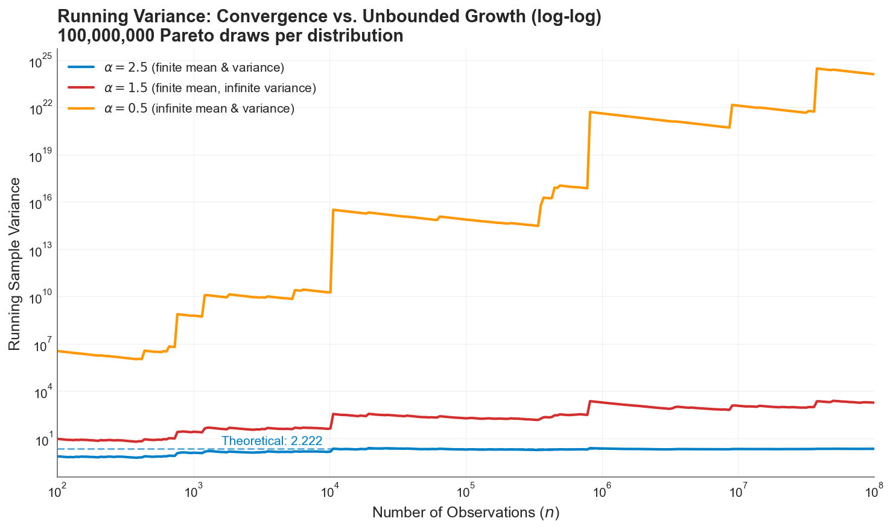
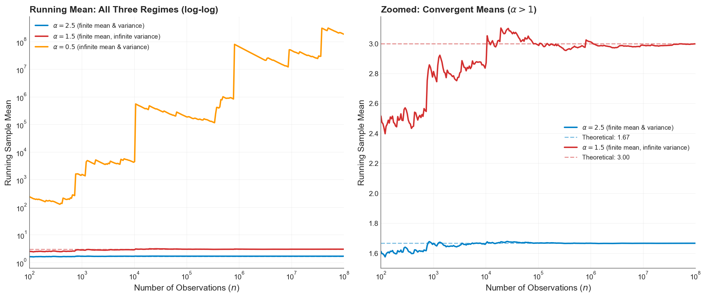
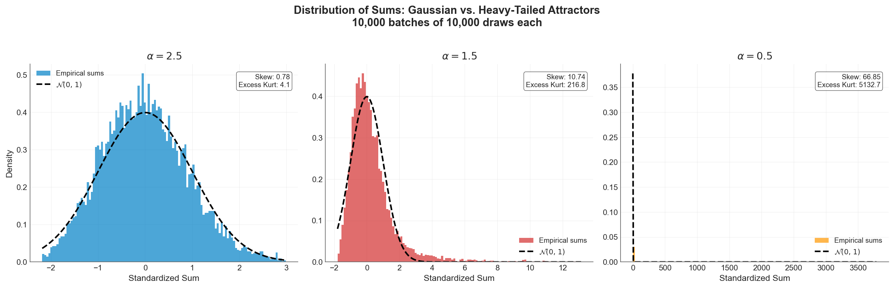

You compute the standard deviation of your catastrophic loss history. Maybe you take extra care to trend everything to present-day rates and on-level for legal environment changes. The software returns a number. Everyone nods and moves on to pricing.

But what if that number is meaningless? Not imprecise, not volatile, not based on too few data points. *Mathematically meaningless*, in the sense that the population quantity it's estimating doesn't even exist as a finite number. The sample standard deviation will always output something, but for certain loss distributions, that output is an artifact of your sample size, not a property of the risk.

This is what happens when insurance losses follow distributions with infinite moments. It's not a theoretical pathology. It's an empirical reality across multiple insurance lines, and it breaks nearly every classical statistical tool the industry relies on.

## The Pareto Distribution and Its Regimes

The Pareto distribution is the workhorse of catastrophic loss modeling. Its survival function follows a power law:

$$S(x) = \left(\frac{x_m}{x}\right)^\alpha, \quad x \geq x_m$$

where $x_m$ is the minimum loss threshold and $\alpha$ is the tail index. A smaller $\alpha$ means a heavier tail and more probability mass in extreme outcomes.

The $\alpha$ parameter determines which statistical moments exist. The $k$-th moment $E[X^k]$ is finite if and only if $\alpha > k$. This creates three qualitatively distinct regimes:

| Tail Index | Mean | Variance | Central Limit Theorem Attractor | Classical Statistics |
| --- | --- | --- | --- | --- |
| $\alpha > 2$ | Finite | Finite | Gaussian | Fully valid |
| $1 < \alpha \leq 2$ | Finite | **Infinite** | Levy $\alpha$-stable | Severely compromised |
| $0 < \alpha \leq 1$ | **Infinite** | **Infinite** | Levy $\alpha$-stable | Completely invalidated |

The boundaries at $\alpha = 2$ and $\alpha = 1$ are not gradual transitions. They are phase changes in the mathematical behavior of the loss process. Cross below $\alpha = 2$ and the variance integral diverges. Cross below $\alpha = 1$ and even the mean ceases to be a well-defined quantity.

## What "Infinite Variance" Actually Looks Like

To make this concrete, I simulated 100 million Pareto draws at each of the three regimes ($\alpha = 2.5$, $\alpha = 1.5$, and $\alpha = 0.5$) and tracked the running sample variance as more observations accumulated.


*Running sample variance on a log-log scale. At $\alpha = 2.5$ (blue), the variance converges to its theoretical value of 2.222. At $\alpha = 1.5$ (red), the sample variance grows without bound, with staircase jumps whenever a single extreme observation arrives. At $\alpha = 0.5$ (orange), the growth is explosive, reaching $10^{24}$ by the end of the sample. The blue dashed line is the theoretical variance for $\alpha = 2.5$, to which it converges within 100k simulations. The red and orange lines don't have a theoretical stable value.*

The blue line is what actuaries expect: a statistic that stabilizes as data accumulates. The red and orange lines are what actually happens when the population variance is infinite. The sample variance doesn't converge. It grows relentlessly, punctuated by sharp upward jumps whenever a single extreme observation enters the sample. After 100 million observations, the $\alpha = 1.5$ sample variance is still climbing. More data doesn't fix this. The estimate is doing exactly what it should: faithfully reflecting a population quantity that is infinite.

## Simulating "Infinite Mean"

The running sample mean tells a different story, but equally important:


*Left panel: running sample mean on a log-log scale. The $\alpha = 0.5$ mean (orange) diverges toward infinity, breaching $10^8$ by the end. Right panel: zoomed view of the two convergent means. At $\alpha = 2.5$ (blue), the mean converges smoothly to $5/3$. At $\alpha = 1.5$ (red), the mean converges to 3 but with much larger fluctuations and visible jumps even at $n = 10^8$.*

For $\alpha = 1.5$, the mean exists and converges, but the path is rough. The infinite variance manifests as persistent, large fluctuations around the true value. For $\alpha = 0.5$, the mean itself diverges. The running average at 100 million observations exceeds $10^8$, and still growing. The concept of an "expected loss" is literally undefined.

The catch is that nothing stops us from cutting off the data collection process, computing sample variance and mean, and calling it a day. The data won't have infinity in the sample. Without explicitly testing for infinite moments, we can misapply standard statistics to our detriment.

## The Central Limit Theorem Breaks Down

The most consequential implication for insurance is the failure of the Central Limit Theorem (CLT). Actuarial pricing, reserving, and capital modeling all rely, explicitly or implicitly, on the assumption that aggregated losses converge to a Gaussian distribution. When the underlying losses have finite variance, this assumption is justified by the CLT.

When they don't, the CLT no longer applies. Instead, the Generalized Central Limit Theorem takes over, and normalized sums converge to a [Levy $\alpha$-stable distribution](https://en.wikipedia.org/wiki/Stable_distribution), a family of heavy-tailed distributions that includes the Gaussian only as a boundary case at $\alpha = 2$.


*Distribution of standardized sums (10,000 batches of 10,000 draws each) against the Gaussian $\mathcal{N}(0,1)$ overlay. Left ($\alpha = 2.5$): the CLT works, the histogram closely matches the bell curve. Center ($\alpha = 1.5$): the sums are heavily right-skewed, far from Gaussian. Right ($\alpha = 0.5$): the distribution collapses into a spike with a massively long tail. The Gaussian overlay is invisible because the scales are incomparable. (Any sample kurtosis values the simulation reports are artifacts of sample size. The population kurtosis is infinite in all three regimes, since kurtosis requires $\alpha > 4$.)*

The left panel is the world actuarial science was built for. The center and right panels are the world many insurance lines actually inhabit. Modeling aggregate losses as Gaussian when the underlying severity has $\alpha < 2$ doesn't produce conservative estimates. It produces estimates from the wrong distribution entirely.

The practical consequence: aggregate risk grows as $n^{1/\alpha}$ instead of $n^{1/2}$. When $\alpha < 2$, this means pooled losses scale *faster than the square root of the number of policies*. The diversification benefit that underwrites the entire insurance business model is mathematically diminished, and in extreme cases, reversed.

## These Distributions Are Real

This isn't theoretical. Empirical studies across multiple insurance lines have found tail indices in the infinite-variance and even infinite-mean regimes.

**Cyber risk** is perhaps the most striking example. [Maillart and Sornette (2010)](https://link.springer.com/article/10.1140/epjb/e2010-00120-8) found that the number of personal identities compromised per breach event follows a power law with exponent $b = 0.7 \pm 0.1$, well below the infinite-mean threshold. Moving from records to dollars, [Peters et al. (2023)](https://pmc.ncbi.nlm.nih.gov/articles/PMC10024527/) applied multiple tail index estimators to dollar-denominated cyber losses across industry sectors and found the most reliable methods (MLE, percentile, weighted least squares) clustering in the range $\alpha \approx 0.1$ to $0.3$, all well below 1. Most recently, [Eling, Ibragimov, and Ning (2025)](https://www.sciencedirect.com/science/article/pii/S0167668725001428) confirmed that tail indices remain "consistently below the threshold of 1" across all types of cyber data examined, and that the heavy-tailedness is persistent over time. When the mean doesn't exist, computing an "expected annual cyber loss" from historical data produces a number that grows without bound as more data arrives. The cyber insurance market's well-documented struggles with pricing and capacity are not just growing pains. They may be symptoms of a mathematically uninsurable risk class without structural intervention.

**Natural catastrophe losses** straddle the infinite-variance boundary. [Conte and Kelly (2018)](https://www.sciencedirect.com/science/article/abs/pii/S0095069616302315) applied two independent tail tests to US tropical cyclone damages and rejected thin-tailed distributions at the 95% confidence level, finding point estimates indicating finite mean but infinite variance ($1 < \alpha < 2$). The benchmark [Danish fire insurance dataset](https://www.cambridge.org/core/journals/astin-bulletin-journal-of-the-iaa/article/estimating-the-tails-of-loss-severity-distributions-using-extreme-value-theory/745048C645338C953C522CB29C7D0FF9), analyzed by McNeil (1997) and [Resnick (1997)](https://www.casact.org/sites/default/files/database/astin_vol27no1_139.pdf), yielded $\alpha \approx 1.4$ from the Hill estimator, confirming infinite variance. Wildfire burned-area distributions (a physical hazard metric, not a direct measure of insured loss) follow frequency-area power laws with [exponents between 1.30 and 1.81](https://www.pnas.org/doi/10.1073/pnas.0500880102) across 18 US ecoregions (Malamud et al., 2005), and [Li and Banerjee (2021)](https://www.nature.com/articles/s41598-021-88131-9) found that the best-fitting distribution for California wildfire sizes shifted from lognormal (1920-1999) to truncated Pareto (2000-2019) with a decreasing shape parameter, suggesting the physical hazard tail has been getting heavier. During the 2017-2018 fire season alone, the insurance industry in California [lost the equivalent of two decades worth of profit](https://www.weforum.org/stories/2023/07/wildfire-risk-extreme-heat-changing-insurance-industry/). The January 2025 Los Angeles wildfires caused [\$53 billion in economic losses and \$40 billion in insured losses](https://www.munichre.com/en/company/media-relations/media-information-and-corporate-news/media-information/2025/natural-disaster-figures-first-half-2025.html), the costliest wildfire event in history. These are not outliers to be trimmed from the dataset. They *are* the dataset, in the sense that a single observation dominates all others.

**Operational risk** in banking, closely analogous to liability and professional lines in insurance, has been shown to exhibit apparently infinite-mean behavior. [Moscadelli (2004)](https://papers.ssrn.com/sol3/papers.cfm?abstract_id=557214), analyzing data collected by the Basel Committee, found that corporate finance, trading, and payment settlement business lines showed shape parameters significantly above 1 (meaning $\alpha < 1$, infinite mean). [Cirillo and Taleb (2016)](https://www.tandfonline.com/doi/full/10.1080/14697688.2016.1162908) confirmed that operational risk losses are "an extremely heavy-tailed phenomenon, able to generate losses so extreme as to suggest the use of infinite-mean models." The Basel Committee ultimately excluded infinite-mean model outcomes from regulatory capital calculations, not because the evidence was wrong, but because the resulting capital figures "did not make economic sense." [BCBS (2015)](https://www.bis.org/publ/bcbs291.pdf) The mathematical reality was too uncomfortable to incorporate.

**Operational risk** in banking shares distributional characteristics with liability and professional lines in insurance. Specifically, heavy-tailed severity with limited data on the largest events. [Moscadelli (2004)](https://papers.ssrn.com/sol3/papers.cfm?abstract_id=557214), analyzing loss data collected by the Basel Committee's Risk Management Group, found that several business lines (including corporate finance, trading and sales, and payment and settlement) yielded GPD shape parameter estimates significantly above 1, implying infinite-mean severity distributions. [Cirillo and Taleb (2016)](https://www.tandfonline.com/doi/full/10.1080/14697688.2016.1162908) reached similar conclusions, characterizing operational risk losses as exhibiting extremely heavy tails consistent with infinite-mean behavior. When the Basel Committee developed its OpCaR calibration model to benchmark capital coefficients for the proposed revised Standardized Approach [(BCBS 291, 2014)](https://www.bis.org/publ/bcbs291.pdf), it excluded model runs yielding infinite-mean parameter estimates from the calibration exercise, not on empirical grounds, but because the resulting capital figures were deemed to lack economic interpretability as regulatory requirements. Notably, this was a pragmatic filter applied during coefficient calibration, not a formal regulatory prohibition on infinite-mean models; the concurrent AMA framework left individual banks latitude in their severity distribution choices.

**Marine liability** losses show direct evidence of extreme tail behavior. [Albrecher and Beirlant (2025)](https://arxiv.org/abs/2511.22272) report extreme value indices $\xi$ between 0.8 and 1.1 for marine liability large-loss data (where $\xi = 1/\alpha$, so $\xi = 0.8$ corresponds to $\alpha \approx 1.25$ and $\xi = 1.1$ to $\alpha \approx 0.9$), placing even the existence of the mean in question.

The following table summarizes empirical tail index estimates across insurance lines:

| Line of Business | Source | $\alpha$ Estimate | Implication |
| --- | --- | --- | --- |
| Danish fire claims | McNeil (1997), Resnick (1997) | ~1.4 | Infinite variance |
| US hurricane damages | Conte & Kelly (2018) | 1 to 2 | Infinite variance |
| US wildfire burned area* | Malamud et al. (2005) | 1.30 to 1.81 | Infinite variance |
| Cyber risk (identity losses) | Maillart & Sornette (2010) | 0.7 | **Infinite mean** |
| Cyber risk (by sector) | Peters et al. (2023) | 0.1 to 0.3 | **Infinite mean** |
| Cyber risk (all types) | Eling, Ibragimov & Ning (2025) | < 1 | **Infinite mean** |
| Marine liability | Albrecher & Beirlant (2025) | 0.9 to 1.25 | Mean questionable |
| Operational risk (Basel data) | Moscadelli (2004) | < 1 (multiple lines) | **Infinite mean** |
| Operational risk | Cirillo & Taleb (2016) | < 1 (certain lines) | **Infinite mean** |

*\*Physical hazard metric (burned area), not insured losses. The relationship between burned area and insured loss depends on exposure concentration.*

## The Nondiversification Trap

Classical insurance theory holds that diversification reduces risk. Pool enough independent risks and the law of large numbers smooths the aggregate. This is the mathematical foundation of mutual insurance, reinsurance, and every actuarial pricing model.

[Ibragimov, Jaffee, and Walden (2009)](https://scholar.harvard.edu/files/ibragimov/files/rev._financ._stud.-2009-ibragimov-959-93.pdf) showed that this logic reverses when the tail index drops below 1. For infinite-mean distributions, pooling independent risks under standard risk measures (VaR, CTE) actually *increases* per-unit risk. Adding more policies to the pool makes each one more expensive to insure, not less.

They called this the **nondiversification trap**: a situation where no individual insurer has an incentive to share risk, even though collective risk-sharing would be beneficial. In a calibration to California residential earthquake insurance, they estimated the cost of this trap at up to $3 billion per year, a deadweight loss caused entirely by the mathematical properties of the tail.

This result connects directly to the puzzling behavior of catastrophe insurance markets. The chronic shortage of capacity, the reluctance of reinsurers to deploy capital, and the repeated market dislocations after major events are all consistent with a market trying to price and diversify risks that don't follow the rules those mechanisms were built on.

## What Breaks in Practice

When the tail index sits below 2, the consequences cascade through every layer of actuarial and risk management practice:

**Sample statistics become deceptive.** Software will always return a number for the sample variance. That number is a pure artifact of your sample size and the largest observation in your dataset. It carries [zero predictive power](risk-measures-under-cat-tail.md) for future dispersion.

**Regression fails silently.** Standard errors assume finite error variance. When errors follow a heavy-tailed distribution with $\alpha < 2$, t-tests and F-tests are invalid, and $R^2$ becomes a random variable that can take any value in $[0, 1]$ regardless of the true model fit.

**Risk measures diverge.** As I explored in [Risk Measures Under Catastrophic Tail Variation](risk-measures-under-cat-tail.md), VaR is structurally blind to what happens beyond its threshold. CTE captures the tail and remains well-defined as long as the mean exists ($\alpha > 1$), making it the best-positioned standard measure in the infinite-variance regime, but it becomes increasingly unstable and sample-dependent as $\alpha$ decreases. [Expectile-based measures](exploring-expectiles.md) offer both coherence and backtestability in the finite-variance regime ($\alpha > 2$), but their population values don't exist when variance is infinite, since they are defined through an asymmetric squared loss that requires $E[X^2] < \infty$.

**The shadow mean grows.** The sample mean systematically underestimates the true severity because it cannot see the tail mass beyond the largest historical observation. As I explored in [Loss Severity Estimation and the Shadow Mean](severity-estimation.md), this shadow can represent the majority of the true expected loss, hiding silently in the region where your data doesn't reach.

## The Ergodic Perspective

The connection between infinite moments and [ergodicity economics](insurance-limit-selection-through-ergodicity-when-the-99p9th-percentile-isnt-enough.md) runs deep.

A process is ergodic when its time average equals its ensemble average: when the experience of one entity over many periods matches the average across many entities in one period. For well-behaved distributions ($\alpha > 2$), the [volatility drag](volatility-drag-vs-premium-drag.md) framework applies cleanly: retained losses have finite variance, the time-average growth penalty is approximately $\sigma^2/2$, and insurance can manage this cost by reducing retained variance to acceptable levels.

In the infinite-variance regime ($1 < \alpha \leq 2$), the $\sigma^2/2$ approximation from the [earlier analysis](volatility-drag-vs-premium-drag.md) breaks down. $\sigma^2$ itself is undefined, so the formula that quantifies the growth penalty has no finite input. The qualitative conclusion is stronger, not weaker: under multiplicative dynamics, the probability of experiencing a loss large enough to devastate the balance sheet is substantially higher than in the finite-variance regime, and individual company trajectories diverge wildly from the ensemble expectation. The pure expected loss is finite (the mean exists), so an "actuarially fair" premium can in principle be computed. But a commercial premium must also include a risk load to compensate for the capital the insurer holds against adverse deviation, and standard risk-loading formulas (variance loading $\lambda \cdot \sigma^2$, standard deviation loading $\lambda \cdot \sigma$) produce infinite charges when variance is infinite. The capital required to support writing such risk, under any variance-based adequacy standard, is unbounded. This is a regime where insurance is existentially necessary for the buyer but economically treacherous for the seller. The resolution, on both sides, is truncation: by capping retained losses at the deductible and insured losses at the policy limit, the distribution is bounded and finite risk loads become calculable. The truncation is what restores the finite volatility drag that makes positive time-average growth possible.

When $\alpha \leq 1$, the problem deepens. The sample mean no longer converges to any finite value. It is dominated by the single largest observation, and every additional extreme draw can reset it by orders of magnitude. The ensemble average, the bedrock of actuarial pricing, doesn't exist as a finite quantity. An "actuarially fair" premium for unlimited coverage cannot be computed because there is no finite expected loss to base it on. Truncation via policy limits still works ($\min(X, L)$ has finite moments of all orders regardless of $\alpha$) but now the limit isn't just capping the risk load, it's creating the expected value itself. The premium becomes entirely a function of where the limit sits, and the [insurance cliff](insurance-cliff-by-risk-profile.md) steepens accordingly.

## What You Can Do About It

The situation is dire but not hopeless. Three strategies transform infinite-moment risks into manageable ones:

**Policy limits truncate the distribution.** A Pareto distribution with $\alpha = 0.5$ and no cap has infinite mean. Attach a policy limit of $L$ and the capped distribution $\min(X, L)$ has finite moments of all orders. Limits don't just cap exposure. They are the mathematical mechanism that makes insurance possible for heavy-tailed risks. The [insurance cliff analysis](insurance-cliff-by-risk-profile.md) shows just how sensitive outcomes are to where that limit sits.

**Estimate $\alpha$ before doing anything else.** The Hill estimator, applied to the largest observations in your loss history (supplemented with industry data), provides a reliable estimate of the tail index. In my simulations, it achieved 1.2% error across all three regimes with a lot of data. Before applying any statistical tool to loss data, know which regime you're in. If $\hat{\alpha} \leq 2$, abandon standard deviations and CLT-based confidence intervals. If $\hat{\alpha} \leq 1$, abandon sample means entirely.

**Use the shadow mean for pricing when the mean exists.** When $\alpha > 1$ and the population mean is finite but empirical averages underestimate it, [parametric estimation](severity-estimation.md) provides a principled alternative. The shadow mean methodology uses extreme value theory to estimate the true tail analytically, recovering the probability mass that historical samples structurally miss. When $\alpha \leq 1$, the mean itself is infinite, and structural truncation through policy limits must be applied first. Only after capping the distribution does a finite expected value exist to anchor pricing to.

## What This Doesn't Cover

This analysis uses pure Pareto distributions, which are the cleanest laboratory for studying infinite moments but are more extreme than the mixture models that describe real insurance portfolios. In practice, loss distributions are compounds: a light-tailed body blended with a heavy-tailed catastrophic component. The catastrophic component may sit in the infinite-variance or infinite-mean regime, and mathematically, infinite moments in any positive-weight component propagate to the mixture: the overall distribution inherits the infinite variance. But in finite samples, the catastrophic component triggers so rarely that standard diagnostic tests may fail to detect the infinite moments, and sample statistics will appear well-behaved until a sufficiently extreme event arrives.

The rest of this series models catastrophic losses at $\alpha = 2.01$, just inside the finite-variance boundary, keeping classical statistics operational while capturing substantial tail risk. But several posts already probe what happens below this boundary: the [risk measures analysis](risk-measures-under-cat-tail.md) and [expectile analysis](exploring-expectiles.md) sweep $\alpha$ from 3.0 down to 1.5, documenting how risk measures diverge as variance becomes infinite, and the [stochastic tail uncertainty framework](stochasticizing-tail-risk.md) explores GPD shape parameters up to 1.5 (corresponding to $\alpha \approx 0.67$), deep into the infinite-mean regime. The empirical evidence surveyed above suggests that for some lines (particularly cyber and certain operational risks) the true $\alpha$ may sit well below the series' baseline of 2.01.

The analysis also doesn't address parameter uncertainty in $\alpha$ estimation, which is substantial with limited data. The [stochastic tail uncertainty framework](stochasticizing-tail-risk.md) provides one approach to this problem. Nor does it address the question of how physical upper bounds (there is a maximum possible loss from any single event, bounded by the total insurable value in the world) interact with mathematical infinite moments. The distributions are "infinite" only in the model. In reality, they are truncated but heavy enough that the infinite-moment framework provides the better working approximation.

## References

1. Albrecher, H., & Beirlant, J. (2025). [Statistics of extremes for the insurance industry.](https://arxiv.org/abs/2511.22272) arXiv preprint.

2. Basel Committee on Banking Supervision. (2014). [Operational risk – Revisions to the simpler approaches.](https://www.bis.org/publ/bcbs291.pdf) Consultative Document, Bank for International Settlements.

3. Cirillo, P., & Taleb, N. N. (2016). [Expected shortfall estimation for apparently infinite-mean models of operational risk.](https://www.tandfonline.com/doi/full/10.1080/14697688.2016.1162908) *Quantitative Finance*, 16(10), 1485-1494.

4. Conte, M. N., & Kelly, D. L. (2018). [An imperfect storm: Fat-tailed tropical cyclone damages, insurance, and climate policy.](https://www.sciencedirect.com/science/article/abs/pii/S0095069616302315) *Journal of Environmental Economics and Management*, 92, 677-706.

5. Eling, M., Ibragimov, R., & Ning, D. (2025). [The changing landscape of cyber risk: An empirical analysis of loss severity and tail dynamics.](https://www.sciencedirect.com/science/article/pii/S0167668725001428) *Insurance: Mathematics and Economics*.

6. Ibragimov, R., Jaffee, D., & Walden, J. (2009). [Nondiversification traps in catastrophe insurance markets.](https://scholar.harvard.edu/files/ibragimov/files/rev._financ._stud.-2009-ibragimov-959-93.pdf) *Review of Financial Studies*, 22(3), 959-993.

7. Li, S., & Banerjee, T. (2021). [Spatial and temporal pattern of wildfires in California from 2000 to 2019.](https://www.nature.com/articles/s41598-021-88131-9) *Scientific Reports*, 11, 8628.

8. Maillart, T., & Sornette, D. (2010). [Heavy-tailed distribution of cyber-risks.](https://link.springer.com/article/10.1140/epjb/e2010-00120-8) *European Physical Journal B*, 75, 357-364.

9. Malamud, B. D., Morein, G., & Turcotte, D. L. (2005). [Characterizing wildfire regimes in the United States.](https://www.pnas.org/doi/10.1073/pnas.0500880102) *Proceedings of the National Academy of Sciences*, 102(13), 4694-4699.

10. McNeil, A. J. (1997). [Estimating the tails of loss severity distributions using extreme value theory.](https://www.cambridge.org/core/journals/astin-bulletin-journal-of-the-iaa/article/estimating-the-tails-of-loss-severity-distributions-using-extreme-value-theory/745048C645338C953C522CB29C7D0FF9) *ASTIN Bulletin*, 27(1), 117-137.

11. Moscadelli, M. (2004). [The modelling of operational risk: Experience with the analysis of the data collected by the Basel Committee.](https://papers.ssrn.com/sol3/papers.cfm?abstract_id=557214) Bank of Italy Working Paper No. 517.

12. Munich Re. (2025). [Wildfires around Los Angeles, severe thunderstorms: US natural catastrophes dominate global losses in the first half of 2025.](https://www.munichre.com/en/company/media-relations/media-information-and-corporate-news/media-information/2025/natural-disaster-figures-first-half-2025.html)

13. Peters, G. W., Malavasi, M., Sofronov, G., Shevchenko, P. V., Trück, S., & Jang, J. (2023). [Cyber loss model risk translates to premium mispricing and risk sensitivity.](https://pmc.ncbi.nlm.nih.gov/articles/PMC10024527/) *Geneva Papers on Risk and Insurance -- Issues and Practice*, 48, 372-433.

14. Resnick, S. I. (1997). [Discussion of the Danish data on large fire insurance losses.](https://www.casact.org/sites/default/files/database/astin_vol27no1_139.pdf) *ASTIN Bulletin*, 27(1), 139-151.

15. World Economic Forum. (2023). [How wildfire risk and extreme heat impacts the insurance sector.](https://www.weforum.org/stories/2023/07/wildfire-risk-extreme-heat-changing-insurance-industry/)

## Download the Code

The full simulation analysis is available in the notebook:

- [Jupyter Notebook -- Infinite Moments and Heavy-Tailed Distributions](https://github.com/AlexFiliakov/Ergodic-Insurance-Limits/blob/main/ergodic_insurance/notebooks/reconciliation/15_infinite_moments.ipynb)

The companion research document provides a deeper mathematical treatment:

- [Research Document -- Infinite Variance and Mean Distributions (PDF)](https://github.com/AlexFiliakov/Ergodic-Insurance-Limits/blob/main/ergodic_insurance/notebooks/reconciliation/Infinite_Variance_and_Mean_Distributions.pdf)

**Install the Framework**:

```python
pip install ergodic-insurance
```
