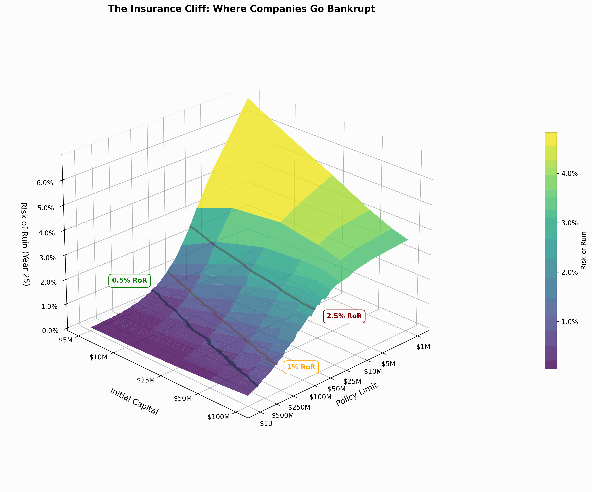
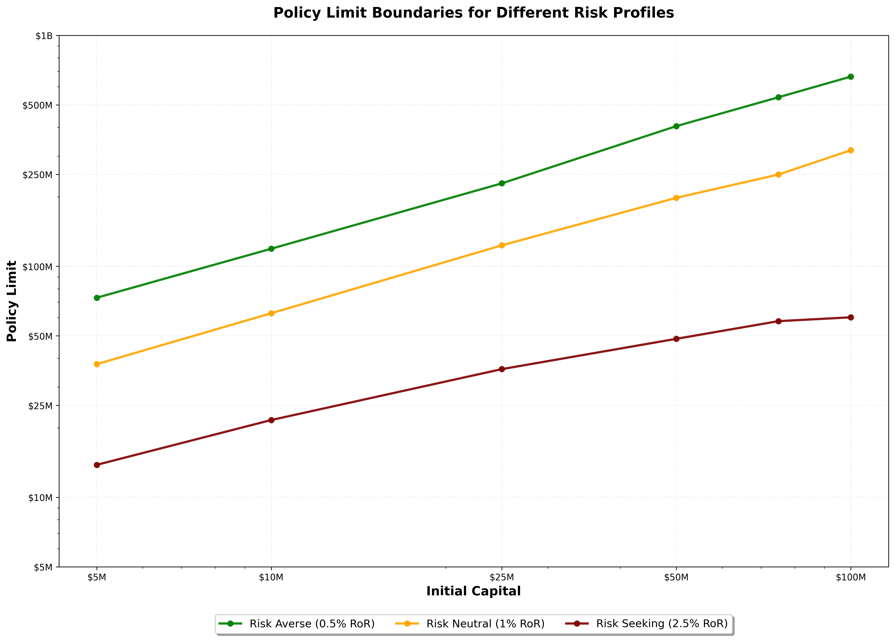

Most companies think insurance limits scale gradually with risk. They don't.

There's a cliff. And most executives have no idea where they're standing on it.

## The Cliff Nobody Sees

When you plot the relationship between initial capital, policy limits, and bankruptcy risk, you don't get a gentle slope.

You get a cliff.

At some point, higher limits don't matter much because losses don't get large enough often enough. The risk of ruin levels off at the top.

But in the active tail of modeled losses, where your business operates, the choice of limits has a disproportionate effect on results.

Here's what this looks like for a sample company with \$10M in capital:
- Risk Seeking (2.5% bankruptcy risk): \$20M policy limit
- Risk Neutral (1% bankruptcy risk): \$60M policy limit
- Risk Averse (0.5% bankruptcy risk): \$120M policy limit

Triple your limit to move from risk-seeking to risk-neutral. Double again to reach risk-averse.

The pattern holds across different capital levels. Not arbitrary. Structural.

When plotted on a log-log scale, the relationship between initial capital and policy limits forms nearly parallel lines for each risk profile. The formula appears to be $\text{Limit} = b \cdot \text{Capital}^m$, where the multiplier and power vary by industry and risk tolerance, but the $m$ **remains relatively static across different ruin risks**.

What this means: a \$100M company doesn't need a fundamentally different insurance strategy than a \$10M company **for policy limits** (the relationship is different for deductibles). Scale the limits proportionally based on the same mathematical relationship.

## How Companies Actually Fail

I ran 100,000 simulations over 25-year horizons across various insurance programs and starting company capitalizations.

The results surprised me.

At \$10M starting capitalization and a \$20M limit, only 13 out of 100,000 simulations resulted in bankruptcy due to multiple significant events.

The vast majority? A single extreme loss.

It's not death by a thousand cuts. It's maybe one catastrophic punch that weakens the company, then a knockout blow takes them out completely.

This changes how you should think about insurance strategy. Traditional approaches focus on managing the frequency of losses. But bankruptcies happen as singular point events: extreme losses exceeding your capacity to absorb them.

The risk of ruin is reasonably ergodic in this sense. You can study outcomes one year at a time and get useful insights.

Growth rate? Different story entirely.

## The Hidden Cost of Single-Year Thinking

Most insurance analysis looks at single-year scenarios.

What's our expected loss this year? What's our worst-case scenario?

This misses the temporal dynamics determining business performance.

Large losses materialize over time without showing up in single-year scenarios. A company is nearly certain to face large losses over 10 or 20-year periods, which in any single year are just part of an outcome distribution.

What if those large losses hit several times in a row? This encumbers the business if it's not adequately insured.

What if many losses occur below the deductible consistently?

The mechanics are not captured with sufficient detail in a single-year scenario.

Growth rate exhibits non-ergodic temporal decay. This means you cannot understand it by looking at one year in isolation. You need to model the full business over time.

## The Risk Appetite Gap

Here's what I suspect: most companies are positioning themselves at a particular probability of ruin without consciously deciding to do so.

Risk appetite is not a well-understood concept in corporate culture. Companies don't know what risk they're taking unless they have sophisticated risk management departments doing this sort of modeling.

The carriers do this modeling for themselves.

They use Dynamic Financial Analysis to project balance sheets under thousands of scenarios. They run 10,000+ iterations across millions of policies and thousands of economic scenarios to understand probability distributions of outcomes.

But their clients? They're making decisions based on last year's losses and maybe broker recommendations.

The analytical rigor exists on one side of the transaction but not the other.

## Beyond Risk of Ruin

Understanding the cliff is just the beginning. There are at least four dimensions to consider:
- Optimization for bankruptcy risk
- Optimization in the lower tails of growth
- Optimization for mean growth
- Optimization for median growth

Increasing insurance limits tends to increase mean growth by removing worst-case catastrophic scenarios. But the trade-off is lower median growth, which tends to reflect average-to-good times.

There's an inherent tension between reducing risk of ruin and decreasing median returns by paying more premium.

When a company optimizes for median growth, the downside gets disregarded.

When optimizing for mean growth, there's more consideration of the downside, but at the expense of all other average-to-great times.

This is the multi-dimensional optimization most companies aren't explicitly managing.

# What This Means for You

**If you're on the carrier side:** View risks on a multi-year basis rather than managing a single renewal period at a time. Recognize lifetime business value and advise your customers accordingly.

**If you're on the insured side:** Recognize the temporal nature of insurance strategy. Don't manage renewals one year at a time.

The cliff is real, and its location is unique to your business (your capital, your loss exposure, your risk profile).

But you don't see it without temporal modeling. You don't understand it with single-year scenarios.

I built this simulation because I saw the gap. Carriers have sophisticated tools to manage their own risk. Their clients deserve the same analytical rigor.

The cost to run on modern hardware is negligible.

The value? Understanding where your company stands on the cliff and making conscious decisions about risk appetite rather than stumbling into them.

That's the difference between managing insurance as a cost center and leveraging it as a growth tool.

## Apply This to Your Company

The complete implementation is available for you to modify and run:

### Download the Code:

- [Jupyter Notebook — Stochastic Tail Simulations](https://github.com/AlexFiliakov/Ergodic-Insurance-Limits/blob/main/ergodic_insurance/notebooks/results_limit_ror_cliff/ergodicity_limit_ror_cliff.ipynb)

- [Python Script — Company and Loss Configuration](https://github.com/AlexFiliakov/Ergodic-Insurance-Limits/blob/main/ergodic_insurance/notebooks/results_limit_ror_cliff/run_limit_ror_cliff_colab.py)

### Install the Framework:

`!pip install --user --upgrade --force-reinstall git+https://github.com/AlexFiliakov/Ergodic-Insurance-Limits`

### Quick Start Guide:

1. Start with the example notebook to understand the structure

2. Modify the company configuration to match your financials (lines 79-86 in the Python script)

3. Adjust loss distributions to reflect your exposure (lines 98-102 for frequencies, 151-183 for severities)

4. Define your uncertainty distributions for the parameters you want to stochasticize

5. Run locally with smaller simulation counts (1,000 sims) or on Google Colab for full-scale runs

### Need Help?

The framework documentation includes:

- [High-level overview and motivation](https://mostlyoptimal.com/)

- [Research paper with mathematical details](https://mostlyoptimal.com/research)

- [Tutorial for adapting to your use case](https://mostlyoptimal.com/tutorial)

## Appendix: Simulation Configuration

### Company Configuration

I used the following company assumptions across all simulations, which can be further tailored to a specific business:
- Asset Turnover Ratio: 1.0 (Revenue = Assets * Turnover)
- EBITA Before Claims and Insurance: 15%
- Tax Rate: 25%
- Retention Ratio: 70% (30% dividends)
- PP&E Ratio: 0% (meaning no depreciation expense)
- Steady \$100K Deductible for all scenarios

Initial Capital varied from \$5M up to \$100M to assess its impact on risk of ruin across a 25-year time horizon.

Bankruptcy had two forms: the first is having assets fall below a threshold of \$10K, and the second is not having the liquidity to meet financial obligations in any given time period.

### Loss Distributions

The simulation employed a four-tier loss structure that captures the full spectrum from routine operational losses to catastrophic events, undifferentiated by nature of loss (so Workers' Compensation, Property, Cyber, etc. were all combined into a single loss structure):

**Tier 1: Attritional Losses** (routine operational incidents)
- Frequency: Poisson varying with revenue
- Severity: Lognormal
- Examples: Equipment damage, minor workplace injuries, small property claims

**Tier 2: Large Losses** (significant incidents)
- Frequency: Poisson varying with revenue
- Severity: Lognormal
- Examples: Major equipment failures, significant product recalls, material liability claims

**Tier 3: Catastrophic Losses** (severe events)
- Frequency: Poisson varying with revenue
- Severity: Pareto
- Examples: Facility fires, large product liability events, major supply chain disruptions

**Tier 4: Extreme Losses** (tail events beyond historical experience)
- Threshold: 99.95th percentile of overall loss distribution
- Severity: Generalized Pareto Distribution (GPD)
- Examples: Company-threatening scenarios with limited historical precedent, such as nuclear verdicts

This structure assumes loss events are independent (no correlation), a simplification that understates systemic risk.

For a more complete overview of the simulation, refer to the research paper [here](https://mostlyoptimal.com/research).