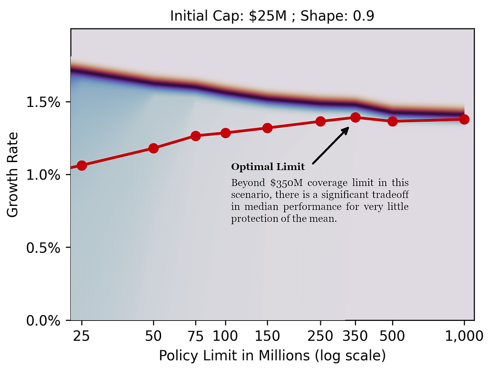

Photo by  [Vida Huang](https://unsplash.com/@rebylulu?utm_source=unsplash&utm_medium=referral&utm_content=creditCopyText)  on  [Unsplash](https://unsplash.com/photos/warehouse-storage-filled-with-pallets-of-goods-I-_wYj9yOzw?utm_source=unsplash&utm_medium=referral&utm_content=creditCopyText)

A single employee error triggers a product recall affecting 2 million units. Total losses: $380 million. Your company purchased a $100 million liability policy because it “covered losses at the 99.9th percentile.” The actuary who recommended that limit followed best practices, used sophisticated models, and got the probability calculations right.

And it doesn’t matter. The remaining $280 million in uncovered losses wipes out 70% of your equity. Your credit rating collapses. Your expansion plans are cancelled. Competitors acquire market share while you’re managing the crisis. Ten years later, you’re still recovering from an event that happened in a single afternoon.

## Power Laws

This is the tail wagging the dog. A single extreme event, occurring once in a company’s lifetime, dominates every strategic decision that came before it. Welcome to full contact statistics. Traditional insurance analytics, focused on expected values and ensemble averages, systematically underestimate how much these rare catastrophes matter to the one company experiencing them.

This is why insurance limit selection matters more than most actuaries realize. It’s not about expected values or ensemble averages. It’s about protecting the actual trajectory of a company operating within a specific timeline. And that requires a fundamentally different analytical framework.

## The Problem

Traditional actuarial limit selection optimizes ensemble averages. But companies don’t operate across ensembles; they operate in time. This post explores how that distinction changes everything about optimal insurance limits.

Press enter or click to view image in full size

Your company’s individual experience is not the ensemble.

_Want to see the results and implications first?_ [_Skip to Results & Analysis._](#results--analysis)

## The Ergodic Perspective

Ergodicity economics asks a deceptively simple question: does the average outcome across many parallel universes match the average outcome one entity experiences over time? For most business decisions with tail risk, the answer is no.

> **For Students**: Ensemble averages calculate what happens “on average” if we ran 1,000 parallel companies. Time averages calculate what happens to one company over 1,000 periods. With tail risk, these diverge dramatically.

When a company faces potential catastrophic losses, the ensemble average calculated across thousands of simulated companies may show strong expected returns.

But the time average (what one actual company experiences) can be devastated by a single extreme event that occurs early in its history.

Insurance transforms these dynamics by redistributing tail risk across the ensemble, allowing individual companies to track growth closer to the time-average rather than suffering the full consequences of statistical outliers.

For this analysis, I simulated corporate trajectories over 50 years to allow ergodic effects to materialize fully.

While a 25-year horizon might be more realistic for strategic planning, the longer timeframe lets us observe how different insurance strategies affect growth convergence (or divergence) over time.

Each corporate configuration is tested across 250,000 scenarios, providing a robust distribution of potential 50-year outcomes.

## Simulation Framework

Press enter or click to view image in full size

The framework builds on the methodology detailed in my research paper at  [https://mostlyoptimal.com/research](https://mostlyoptimal.com/research), which introduced a new open-source framework for ergodic insurance analysis, and then applied it to explore deductible selection. Here, I apply that framework to analyze insurance limits.

### Loss Structure

The simulation employs a four-tier loss structure that reflects the reality of corporate risk exposure:

Revenue serves as the exposure base for all loss frequencies, scaling risk with company size.

This four-tier approach captures the full spectrum from routine operational losses to true black swans, excepting loss correlations.

Press enter or click to view image in full size

Resulting illustrative aggregate severity distribution, with orange highlighting the tail. Logarithmic x-axis.

### Financial Model

**Corporate Accounting**

The balance sheet simulation includes realistic (though intentionally simplified) corporate accounting.

Revenue is deterministic and proportional to assets, making net income stochastic purely through loss realizations. This isolates the impact of insurance decisions from other business volatility.

**Insurance Structure**

The insurance structure consists of:

-   A per-occurrence deductible (held constant at $500K for this analysis, but other deductibles don’t materially sway the analysis of limits)
-   A single per-occurrence limit (the variable under study)

**Insurance Pricing**

Insurance pricing assumes carriers can accurately estimate the underlying loss distribution; a strong but necessary assumption for this analysis.

Premiums are loaded using a loss ratio to account for risk margin, profit load, and administrative expenses. For this particular study, I used a 60% loss ratio.

To maintain analytical clarity, I’ve removed time value of money effects, treating all calculations on an approximate present-value basis. Letter of credit costs on insurance payouts serve to preserve a notion of preset-value borrowing costs.

## Key Assumptions & Limitations

This framework makes several simplifying assumptions:

-   Uniform loss ratios across all insurance layers (reality would show varying margins by layer)
-   Perfect insurer knowledge of loss distributions
-   Uncorrelated loss events
-   Deterministic revenue growth
-   No inflation or discounting effects

These simplifications allow us to isolate the ergodic effects of limit selection, but they also mean  **these specific results do not generalize directly to real corporate structures**. However, the directional insights and underlying mechanisms should transfer to more complex scenarios, and the framework can be adapted to study individual cases.

## Understanding Tail Risk

Press enter or click to view image in full size

Before diving into results, we need to establish what “tail risk” means in this context.

The tail of a probability distribution represents extreme outcomes: events far from the mean that occur rarely but carry enormous consequences.

Tail “thickness” determines how much probability mass sits in these extremes and how quickly probabilities decay as events become more severe.

A thick-tailed distribution (like the Pareto we use for catastrophic losses) assigns non-trivial probability to events many standard deviations from the mean.

This has profound implications for insurance: the thicker the tail, the more value high limits provide.

For this study, I restrict the analysis to distributions with finite mean and finite variance.

While this excludes some “pathological” heavy-tailed distributions (like power laws with infinite variance), it still captures substantial tail risk and keeps the mathematics tractable.

Future posts will explore those more extreme scenarios.

The Shape parameter in our results controls tail thickness: lower Shape values produce thicker tails with a higher probability of extreme events.

> **For Practitioners**: When estimating tail risk for your business, the Shape parameter is critical. A Shape of 0.5 vs 0.9 can mean the difference between recommending a $250M limit and a $500M+ limit for the same company. Historical loss data and industry benchmarks help calibrate this, but uncertainty remains substantial.

## Results & Analysis

> _Real companies facing real insurance decisions need to model their specific exposure profiles, capital structures, and risk appetites. These results provide directional guidance, not prescriptive answers._

The visualization below shows annualized growth rates over 50 years plotted against per-occurrence insurance limits:

### Reading the Visualization

The grid structure spans two key dimensions:

-   **Columns**  (left to right): Increasing initial capitalization from $25M to $150M
-   **Rows**  (top to bottom): Increasing tail thickness (Shape parameters 0.5, 0.7, and 0.9)

Each subplot displays:

-   Distribution bands (shaded blue/purple regions) showing various percentiles (10th, 25th, 50th/median, 75th, 90th, 99th)
-   Navy color represents the region of the median
-   Red line with markers indicates the mean

**Exploring Sample Facets**

Let’s zoom in on some specific examples from above:

Press enter or click to view image in full size

Since the tail shape of 0.5 results in a relatively light tail, few large losses are priced into the simulation, and the large limits appear very cheap. In practice, fixed administrative costs at higher limits would increase the loss ratios, making these limits more expensive than they seem in this scenario.

Press enter or click to view image in full size

We increase tail thickness so tradeoffs between the Median (navy) and the Mean (red) can be explored more clearly.

Press enter or click to view image in full size

If this tail scenario holds, and companies act rationally, the market will likely be dominated by supply side.

### Pattern Analysis

Several striking patterns emerge:

**1. Mean-Median Divergence**

As limits increase, we observe a consistent pattern: median growth rates remain relatively flat or decline slightly, while the separation between mean and median narrows. This is the ergodic effect in action.

With low limits, catastrophic losses that exceed coverage devastate individual company trajectories, creating massive dispersion in outcomes.

The mean gets pulled down by these tail events while the median (representing the “typical” outcome) stays relatively high.

High limits eliminate this downside, compressing the distribution and bringing the mean and median closer together.

This represents a fundamental tradeoff:  **higher limits sacrifice some median performance to protect against worst-case scenarios**.

From an ensemble perspective (comparing many companies), lower limits look attractive. From a time-average perspective (one company’s actual path), higher limits provide crucial protection.

**2. Capitalization Effects**

The relationship between company size and optimal limits is non-obvious but actuarially sound:

-   **$25M capitalization**: Across all tail assumptions, limits in the $350M-$500M range appear optimal. These companies are vulnerable to mid-sized catastrophic events and need substantial coverage relative to their capital base.
-   **$50M capitalization**: Tail assumptions become crucial. With thinner tails (Shape 0.5), limits around $250M suffice. With thicker tails (Shape 0.9), optimal limits push toward $500M or higher. The risk profile materially changes the calculus.
-   **$75M-$100M capitalization**: These larger companies show significant appetite for limits, especially under thick-tail scenarios. Optimal limits can rationally exceed $500M.

This pattern aligns with the capital preservation logic: companies with higher capitalization have more to lose from extreme events.

While large companies often self-insure smaller losses (choosing high deductibles), they simultaneously purchase high limits to protect their substantial capital base.

The limited liability structure of modern corporations reinforces this dynamic. A $25M company can “only” lose $25M, but a $100M company faces quadruple that downside.

High limits become proportionally more valuable as capitalization increases.

**3. Tail Thickness Amplification**

Moving down the rows (increasing tail thickness), we see divergence patterns amplify.

With thin tails (Shape 0.5, top row), all capitalizations show relatively modest mean-median gaps and limited sensitivity to insurance limits beyond certain thresholds.

With thick tails (Shape 0.9, bottom row), the distributions spread dramatically.

The mean drops significantly relative to the median, and the value of high limits becomes unmistakable.

The 10th percentile outcomes diverge sharply from median outcomes, illustrating how tail events can permanently impair growth trajectories.

This underscores a crucial point:  **tail risk assessment is not an academic exercise**. Getting the tail wrong by even modest amounts can lead to catastrophically wrong limit selections.

## Interpreting the Mean Limits (Red Line)

The red line traces the mean annualized growth rate after 50 years and 250,000 scenarios. This trajectory reveals intuitive patterns:

-   Optimal limits increase with capitalization
-   Optimal limits increase with tail thickness
-   The rate of increase accelerates in the thick-tail scenarios
-   Even “small” companies with heavy tail exposures should consider surprisingly high limits

## Key Insights & Implications

### What Generalizes

Several insights from this analysis should transfer to more complex scenarios:

1.  **The ergodic tradeoff is real**: Higher limits protect time-average growth at the expense of ensemble-average efficiency. This tradeoff exists regardless of specific assumptions.
2.  **Capitalization drives limit appetite**: Larger companies rationally purchase higher limits to protect capital bases, even as they may self-insure smaller losses. This isn’t about risk aversion; it’s about preserving optionality for future growth.
3.  **Tail uncertainty matters enormously**: Small changes in tail assumptions drive significant changes in optimal limits. Companies uncertain about their tail exposure should err toward higher coverage.
4.  **The value of limits compounds over time**: The 50-year horizon reveals cumulative effects that single-period analysis misses. A “slightly suboptimal” limit selection can compound into substantially different growth trajectories.

### What Doesn’t Generalize

These specific results depend heavily on the configuration choices:

-   The tail assumptions
-   The $500K deductible assumption
-   The 60% uniform loss ratio
-   The deterministic revenue model
-   The absence of loss correlations
-   The present-value simplification

Real companies facing real insurance decisions need to model their specific exposure profiles, capital structures, and risk appetites. These results provide directional guidance, not prescriptive answers.

### Practical Implications for Actuaries and Risk Managers

This analysis suggests several shifts in how we might approach limit selection:

1.  **Time horizons matter**: Evaluating limits over multi-decade horizons rather than single policy periods reveals different optimal choices. Strategic insurance buying should reflect strategic time horizons.
2.  **Two distribution moments aren’t enough**: Mean and variance don’t fully capture tail dynamics. Actuaries need to engage seriously with distribution shape, particularly in the tails.
3.  **Capital structure integration**: Limit selection shouldn’t happen in isolation from capital planning. The optimal insurance program depends fundamentally on balance sheet structure and growth objectives.
4.  **Ensemble thinking can mislead**: Traditional actuarial methods that focus on expected values across portfolios can produce poor guidance for individual entity decisions under tail risk.

## Limitations & Future Research

This analysis represents an early iteration of the framework. Several enhancements would make it production-ready:

-   **Layered loss ratios**: Different insurance layers typically carry different margins. High excess layers often have lower loss ratios than primary layers due to basis risk and data uncertainty.
-   **Time value of money**: Incorporating proper discounting and inflation would affect the relative value of premium expenditure versus loss protection.
-   **Loss correlations**: Many catastrophic events trigger multiple loss types simultaneously. Correlation structures likely increase the value of high limits.
-   **Stochastic revenue**: Allowing revenue to vary with economic cycles, competitive dynamics, and recovery from losses would create additional interactions with insurance strategy.
-   **GPU parallelization**: The 250,000 scenarios per configuration are computationally intensive. GPU acceleration would enable faster iteration and more complex models.

Beyond technical enhancements, several research questions emerge:

-   What does the demand side of the limits look like under layered insurance structures? What is the surface of optimal limits when varying loss ratios?
-   Can we identify heuristics or decision rules that approximate optimal limit decisions without complete tail modeling?
-   How do these dynamics change with infinite-variance distributions (Generalized Pareto with Shape of 1.0+)?

My immediate next research focus will explore tail thickness more deeply and investigate layered loss ratio structures that better reflect real insurance markets.

## Final Thoughts

Press enter or click to view image in full size

> **Insurance limits protect time-average growth trajectories from tail events that can permanently impair corporate prospects.**

Insurance limit selection, viewed through an ergodic lens, reveals patterns that traditional actuarial analysis can miss. The tradeoff between median and mean performance, the interaction between capitalization and limit appetite, and the amplifying effects of tail thickness all emerge clearly from long-term simulation.

Remember that $380M product recall from the opening? A company using this framework would have seen why a $100M limit left them catastrophically exposed. The mean growth trajectories for companies with Shape 0.9 and $50M capitalization clearly show that optimal limits approach or exceed $400M — precisely what’s needed to avoid the tail-wagging-dog scenario that devastated our hypothetical company.

For actuaries and risk managers, the message is clear:  **insurance limits aren’t just about expected loss coverage. They’re about protecting time-average growth trajectories from tail events that can permanently impair corporate prospects**.

The specific limits that emerge from this analysis apply only to the configuration studied. But the framework and approach generalize. Companies serious about strategic risk management should model their specific exposures, run long-term simulations, and evaluate insurance decisions as a dynamic strategy over multi-decade horizons rather than single policy periods.

**Want to explore your own limit selection scenarios?**  The complete methodology is at  [mostlyoptimal.com/research](https://mostlyoptimal.com/research), and the framework tutorial is at  [mostlyoptimal.com/tutorial](https://mostlyoptimal.com/tutorial).

I welcome your feedback in the comments: Do these insights align with your experience? Where do the simplifications break down most severely? What other scenarios would be valuable to explore?

## Appendix — Additional Diagrams for the Curious

I simulated a lot more configurations than I presented in this blog post, so I’m posting them all for the curious as an appendix.

### $500K Deductible with Additional Configurations

This contains the graphs we explored earlier, plus a few more:

In the bottom-right corner, you can see that certain heavy-tailed assumptions imply that low coverage limits deteriorate median performance, not just the mean, at higher initial capitalizations where there is significant liability exposure.

### $250K Deductible with Additional Configurations

This represents configurations above at a lower deductible:

### $500K Deductible with More Dense Extreme Losses

In these configurations, the extreme tail attaches at a higher threshold, resulting in denser extreme losses.

### $250K Deductible with More Dense Extreme Losses

### t-SNE Plot of Results

t-SNE maps high-dimensional data to 2 or 3 dimensions by ensuring that similar observations remain neighbors, and serves as an effective exploratory visualization tool. It uses probability distributions to measure similarity in both spaces. Unlike PCA, you can’t easily interpret the axes, and distances between distant clusters aren’t meaningful; plus, it’s stochastic.

Each point on the plot below is a different scenario configuration and represents 250,000 simulations over 50 years. The t-SNE algorithm was used to automatically group these results into coherent collections, although it’s not apparent what each island represents.

-   The tombolo on the left side of the plot appears to be a bridge of high-limit and heavy-tail configurations that fare poorly by average measures, but who are reasonably well protected in the worst cases.
-   The island on the bottom-right represents scenarios without insurance.
-   The island on the top-left represents configurations with the thinnest tail (no GPD attachment).

## **Source Files**

You can explore this setup by downloading the following Jupyter Notebook and the associated Python Script. You need to configure the scenario parameters and increase the number of simulations once you’re satisfied with your setup.

[Jupyter Notebook — Sample Tail Simulations](https://github.com/AlexFiliakov/Ergodic-Insurance-Limits/blob/main/ergodic_insurance/notebooks/results_tail_sim_01/sample_tail_sims_parallel.ipynb)

[Python Script — Company Configuration](https://github.com/AlexFiliakov/Ergodic-Insurance-Limits/blob/main/ergodic_insurance/notebooks/results_tail_sim_01/run_tail_simulation_colab.py)

You need both of these to run, plus run the following in a virtual environment to get the underlying framework:

!pip install --user --upgrade --force-reinstall git+https://github.com/AlexFiliakov/Ergodic-Insurance-Limits

### Read About the Framework

[https://mostlyoptimal.com](https://mostlyoptimal.com/)  contains a high-level overview and the motivation for creating this framework.

[https://mostlyoptimal.com/research](https://mostlyoptimal.com/research)  includes a research paper that describes the framework in some detail.

[https://mostlyoptimal.com/tutorial](https://mostlyoptimal.com/tutorial)  consists of a guide to get started in applying the framework to your specific use cases.

