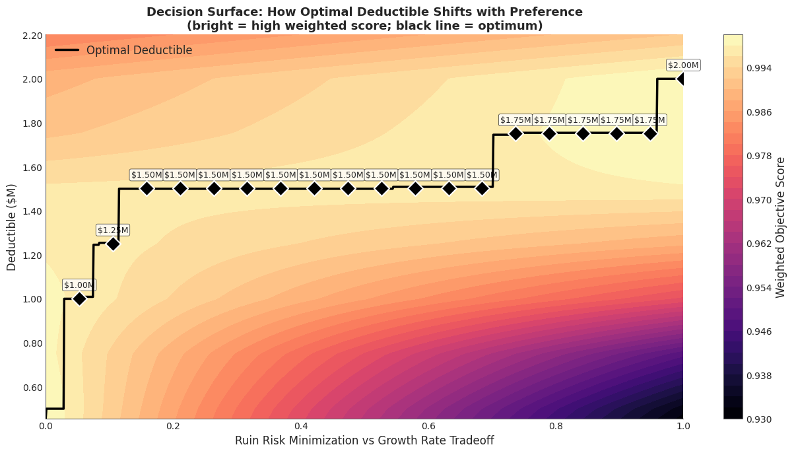
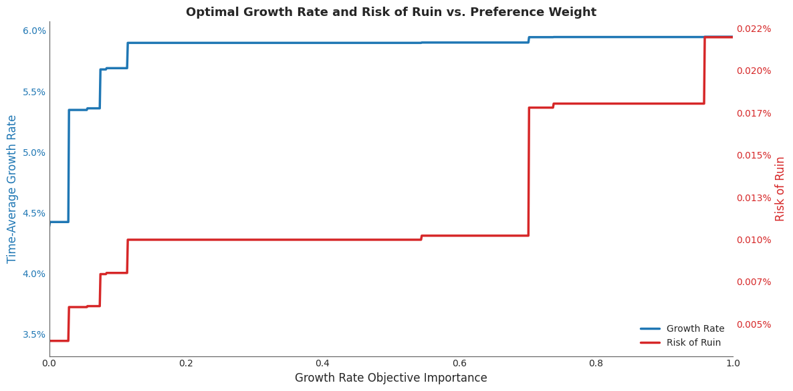
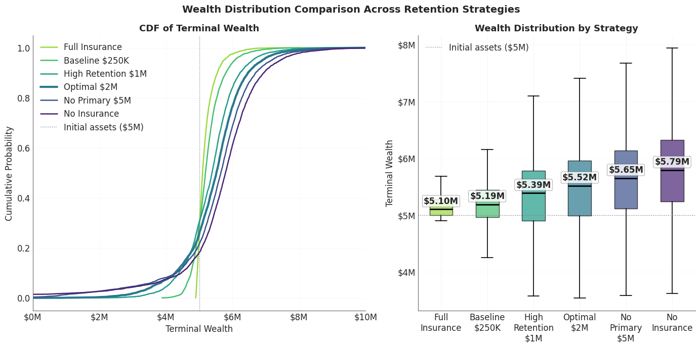
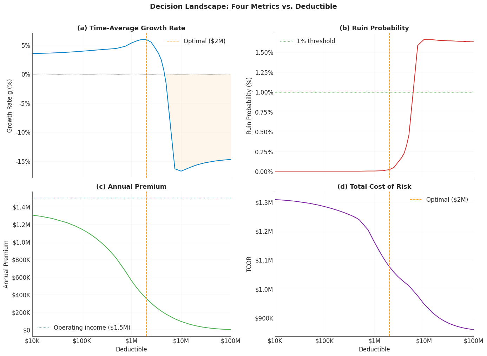

There is no single "right" deductible for a business.

Ask a broker and you'll get a number. Ask an actuary and you'll get a different number. Ask a CFO and you'll get a budget constraint disguised as a number. Each is optimizing for a different objective, and none of them is wrong, because the deductible decision is fundamentally multi-objective.

This post frames deductible selection as what it actually is: a trade-off between long-term growth and survival. The Pareto frontier that emerges reveals which retentions are defensible, which are dominated, and where the "right" answer depends entirely on how much risk the decision-maker is willing to accept.

## Two Objectives, One Decision

Every deductible choice implicitly takes a position on two questions:

**How fast do I want to grow?** Higher deductibles save premium, which compounds into equity over time. The [ergodic framework](insurance-limit-selection-through-ergodicity-when-the-99p9th-percentile-isnt-enough.md) measures this through the time-average growth rate $g = E[\ln(W_T / W_0)]$, the quantity that determines whether a company doubles its equity in 12 years or 20.

**How likely am I to survive?** Higher deductibles expose the company to retained losses that, in a bad year, can exceed the capacity to absorb them. The [insurance cliff](insurance-cliff-by-risk-profile.md) showed that bankruptcies are driven by singular catastrophic events, not attritional accumulation. The probability of ruin $P(W_T \leq 0)$ captures this existential dimension.

These two objectives pull in opposite directions. Full insurance eliminates ruin but drowns the company in [premium drag](volatility-drag-vs-premium-drag.md). Self-insurance maximizes retained capital but leaves the tail unhedged. Somewhere between them lies a frontier of defensible choices.

## The Experiment

I modeled the same middle-market manufacturer from the [volatility](all-about-volatility.md) analysis: \$5M assets, \$10M revenue (2.0x asset turnover), 15\% operating margin, and 50\% revenue volatility. The loss model uses the three-component compound Poisson structure (attritional, large, and catastrophic claims) with a Pareto tail at $\alpha = 2.01$ for catastrophic losses.

Key parameters:
- **Expected annual loss**: ~\$1.14M against \$1.5M operating income, a 76% loss-to-income ratio. This is genuinely existential territory, not a theoretical exercise.
- **Insurance tower**: Four layers from primary (\$250K attachment) through catastrophic (\$50M xs \$50M), with a total program limit of ~\$100M.
- **Simulation**: 50,000 Common Random Number paths across 58 deductible levels from \$0 to \$100M, run across 48 parallel cores. Every strategy faces the same storms; the only difference is how each program is designed.

The optimizer evaluated each deductible against both objectives simultaneously. No weighting, no single composite score. Just: what growth rate does this retention produce, and what ruin probability does it carry?

## The Pareto Frontier

Of 58 deductible levels evaluated, only **6 are non-dominated**. The rest are strictly inferior: some other deductible delivers both higher growth *and* lower ruin probability. A company operating at a dominated point is leaving money on the table and taking unnecessary risk simultaneously.

The non-dominated set traces a frontier from full insurance (zero ruin, modest growth) up to the growth-maximizing optimum. Here's the picture across the full sweep:

| Deductible | Growth Rate | Ruin Prob | Annual Premium | Premium/EBIT |
| --- | --- | --- | --- | --- |
| \$0 (full insurance) | +3.44% | 0.00% | \$1,343,705 | 90% |
| \$250K (baseline) | +4.22% | 0.00% | \$988,818 | 66% |
| \$1.0M | +5.35% | 0.01% | \$558,672 | 37% |
| **\$1.5M (knee)** | **+5.90%** | **0.01%** | **\$429,566** | **29%** |
| **\$2.0M (optimal)** | **+5.95%** | **0.02%** | **\$353,375** | **24%** |
| \$3.0M | +4.51% | 0.12% | \$263,754 | 18% |
| \$5.0M | -1.63% | 0.46% | \$175,801 | 12% |
| \$100M (no insurance) | -14.71% | 1.63% | \$0 | 0% |

The growth rate difference between full insurance (+3.44%) and optimal retention (+5.95%) is **2.51 percentage points**, a 73% improvement in the growth exponent for accepting just 0.02% ruin probability. But push the deductible past the optimum and the picture inverts rapidly: at \$3M, growth has already dropped a full percentage point; at \$5M, it goes negative. Beyond the optimum, everything is dominated, worse on *every* dimension.

This connects directly to the [volatility drag](volatility-drag-vs-premium-drag.md) decomposition. Below the optimum, premium drag dominates: the company is overpaying for smoothness. Above it, volatility drag takes over: retained variance compounds against long-term growth faster than premium savings can offset.

## Where Preferences Meet the Frontier

The frontier tells you which deductibles are defensible. But which one should *you* pick? That depends on how much weight you place on growth versus safety.

I swept a preference weight $w$ from 0 (pure ruin minimization) to 1 (pure growth maximization), computing a weighted objective score at each point:

$$\text{score} = w \cdot \text{normalized\_growth} + (1 - w) \cdot \text{normalized\_safety}$$

The decision surface below shows the result. The black line traces the optimal deductible as preference shifts. The color encodes the weighted objective score (brighter = better).


*As the decision-maker's preference shifts from pure ruin minimization (left) to pure growth maximization (right), the optimal deductible steps upward from \$1.0M to \$2.0M. The broad plateau at \$1.5M shows this retention is optimal across most of the preference spectrum.*

The most striking feature is that **the optimal deductible is remarkably stable**. For preference weights between 0.15 and 0.70, the answer is \$1.5M. Stretch that range to $w = 0.95$ and you only move to \$1.75M. The deductible is insensitive to moderate shifts in risk appetite, which means the "right answer" conversation is narrower than most people assume.

Only at the extremes does the answer change meaningfully. A decision-maker who cares *exclusively* about safety ($w < 0.05$) drops to \$1.0M. One who cares *exclusively* about growth ($w = 1.0$) reaches \$2.0M. The full range of defensible retentions spans just \$1.0M to \$2.0M, a factor of 2x.

## Growth and Ruin at the Optimum

What does the decision-maker actually get at each preference point? The chart below tracks both the time-average growth rate (blue) and the ruin probability (red) at whichever deductible is optimal for that preference weight.


*Blue: time-average growth rate at the optimal deductible for each preference weight. Red: corresponding ruin probability. Growth saturates quickly, reaching ~5.9% by $w = 0.10$, while ruin stays below 0.02% until the growth-heavy end of the spectrum.*

Growth saturates early. By $w = 0.10$, the growth rate has already reached ~5.9%, within 5 basis points of its maximum. The remaining 90% of the preference spectrum buys almost nothing in additional growth, but past $w = 0.70$, ruin probability starts climbing. The marginal trade-off is asymmetric: you get most of the growth benefit for very little ruin cost, but the last fraction of growth comes with disproportionate risk.

This asymmetry is a practical gift. It means the "right" deductible is robust to uncertainty in the decision-maker's own preferences. Even if you can't precisely quantify your risk appetite, the answer barely changes.

## How Wealth Distributions Shift



***Left panel:** CDF of terminal wealth for 6 strategies (Full Insurance, Baseline \$250K, High Retention \$1M, Optimal \$2M, No Primary \$5M, Self-Insurance). **Right panel:** Box plots (no outliers) showing median and spread for each strategy. The optimal deductible produces the best median outcome ($5.52M) while keeping the lower tail above ruin. Full insurance has a tighter distribution but stunted upside.*

The aggregate statistics tell one story. The wealth distributions tell a richer one.

At full insurance, the terminal wealth distribution is tight: median \$5.10M, with P10 at \$4.94M and P90 at \$5.53M. Zero ruin, but the upside is capped. Premium absorbs so much cash flow that the company barely grows beyond its starting position.

At the optimal \$2.0M deductible, the distribution fans out: median \$5.49M, P10 at \$4.25M, P90 at \$6.47M. The company accepts a wider range of outcomes in exchange for a higher center of mass. The lower tail extends further, but stays well above ruin.

At no insurance, the picture deteriorates. Median wealth is highest (\$5.79M), because in the *majority* of paths where nothing catastrophic happens, the company keeps all its premium dollars. But P10 drops to \$4.42M, and 1.6% of paths end in bankruptcy. The ensemble average looks great. The time-average tells a different story, which is the [core insight of ergodicity economics](insurance-limit-selection-through-ergodicity-when-the-99p9th-percentile-isnt-enough.md).

## The Decision Landscape



***(a)** Ergodic Growth Rate: peaks at \$2M, drops sharply past \$3M, goes negative by \$5M. **(b)** Ruin Probability: near-zero until \$2M, then accelerates once the deductible exceeds the primary-layer ceiling. **(c)** Annual Premium: drops steeply in the primary-layer range and flattens for excess layers. **(d)** Total Cost of Risk (TCOR): the shape tracks Annual Premium, but the y-axis is tighter.*

Viewed together, the four dimensions of the deductible decision reveal why extremes fail and the interior wins:

- **Growth rate** peaks at an interior deductible (\$2M), not at either extreme. This is the ergodic optimum where premium savings and volatility costs balance.
- **Ruin probability** is near-zero up to \$2M, then accelerates once the deductible exceeds the primary-layer ceiling. The [insurance cliff](insurance-cliff-by-risk-profile.md) dynamics emerge: a modest increase in retention can produce a disproportionate jump in ruin risk.
- **Annual premium** drops steeply in the primary-layer range (\$0-\$5M) and flattens beyond. Most of the premium savings are captured in the first \$2M of retention.
- **Total cost of risk** tracks annual premium. Full insurance costs a certain \$1.34M in premium. No insurance costs nothing in premium but imposes an average of $850K with volatility.

## Practical Implications

**Most deductibles are dominated.** Of 58 levels evaluated, 52 are strictly worse than some other option on both growth and ruin. Before debating which deductible is "right," check whether your current retention is even on the efficient frontier. If it isn't, you can improve on *every* dimension simultaneously by moving to a frontier point.

**The efficient range is narrow.** For this company, the entire defensible set runs from \$1.0M to \$2.0M. That's a much tighter band than most renewal conversations suggest. The debate over whether to retain \$500K or \$5M is a debate between two dominated options.

**Risk appetite matters less than you think.** The optimal deductible only moves by \$1M across the full spectrum of risk preferences in this experiment. Before you debate over which objective blend to maximize, try to analyze the implications. Unless you occupy an extreme position (purely safety-focused or purely growth-focused), the answer may be approximately the same.

**The real conversation is about objectives, not numbers.** Presenting a board with "the optimal deductible is \$1.5M" invites argument. Presenting them with "here's the frontier of defensible options, and here's what each one costs in growth and ruin probability" invites a productive conversation about risk appetite. The frontier is the tool; the deductible falls out of the conversation.

## What This Doesn't Cover

This analysis uses a single company profile, a one-year simulation horizon, and deterministic operating margins. It doesn't capture multi-year compounding dynamics (where the [volatility drag](volatility-drag-vs-premium-drag.md) effects compound), correlated loss events, or the interaction between deductibles and the [dual volatility](all-about-volatility.md) environment. The insurance tower uses simplified analytical pricing. These constraints keep the Pareto analysis clean but don't capture the full complexity of real insurance programs.

For how tail uncertainty propagates through insurance decisions, see [Stochasticizing Tail Risk](stochasticizing-tail-risk.md). For the risk measures that inform capital requirements alongside this optimization, see [Risk Measures Under Catastrophic Tail Variation](risk-measures-under-cat-tail.md) and [Exploring Expectiles](exploring-expectiles.md). For the severity estimation that feeds the loss model, see [Loss Severity Estimation and the Shadow Mean](severity-estimation.md).

## Download the Code

The full Pareto frontier analysis, including all simulation parameters, dominance filtering, knee-point identification, and visualizations, is available in the notebook:

- [Jupyter Notebook — Pareto Frontier Analysis](https://github.com/AlexFiliakov/Ergodic-Insurance-Limits/blob/main/ergodic_insurance/notebooks/optimization/03_pareto_analysis.ipynb)

**Install the Framework**:

```python
pip install ergodic-insurance
```
