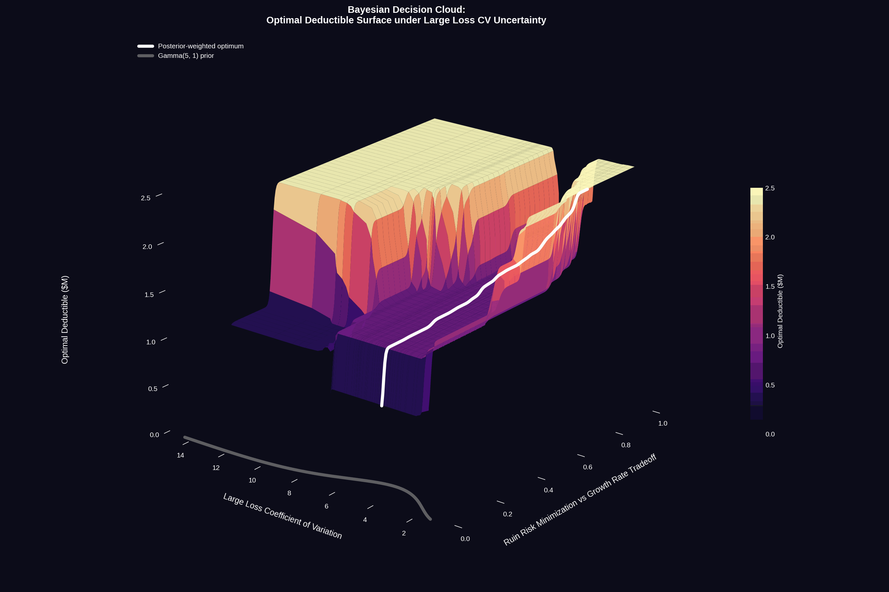
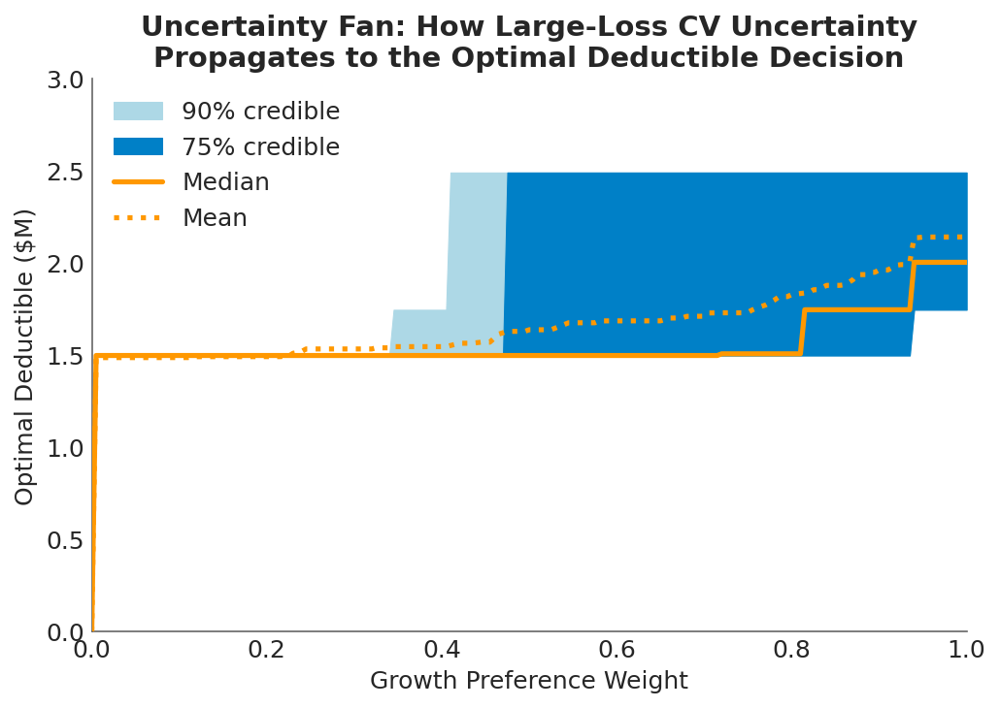

The [previous post](objective-frontier.md) found something reassuring: across a wide range of risk preferences, the defensible set of deductibles spans just \$1.0M to \$2.0M. The "right answer" conversation is narrower than most renewal debates suggest.

But that analysis assumed a fixed loss severity distribution. What happens when we admit we don't know the severity environment with certainty?

## One Assumption, Quietly Doing All the Work

The [Objective Frontier](objective-frontier.md) held every loss parameter constant and swept over risk preferences. That's the right first step: isolate how much the answer depends on what the decision-maker *wants*. The conclusion was encouraging. Preferences matter less than you'd think.

The [dual volatility sweep](all-about-volatility.md) went broader, varying both loss volatility and operational volatility simultaneously across 100,000 scenarios. That revealed a counterintuitive result: operational volatility drives the deductible decision 5x more than loss volatility. But the joint sweep makes it hard to isolate what the loss severity assumption alone is doing to the frontier.

This post strips the problem down. Same company, same Pareto frontier, same multi-objective framework. But instead of holding loss severity fixed or sweeping two dimensions at once, I vary a single parameter: the coefficient of variation (CV) on large-loss severity. How sensitive is the "right" deductible to how volatile we believe large losses to be?

The answer is a surface, not a point. And the shape of that surface has a feature I didn't expect.

## The Experiment

The setup follows the [Objective Frontier](objective-frontier.md) analysis. A middle-market manufacturer with \$5M assets, \$10M revenue (2.0x asset turnover), 15\% operating margin, and 50\% revenue volatility. The loss model uses the same three-component compound Poisson structure (attritional, large, and catastrophic claims) with a Pareto tail at $\alpha = 2.01$ for catastrophic losses. Expected annual loss is ~\$1.14M against \$1.5M operating income, a 76% loss-to-income ratio.

The insurance tower is the same four-layer commercial program, from primary (\$250K attachment) through catastrophic (\$50M xs \$50M), with ~\$100M total program limit.

What's new is the sensitivity dimension. I placed a **Gamma(5, 1) prior** on the large-loss severity CV, representing Bayesian uncertainty about how heavy-tailed the loss environment really is. Think of it as encoding the question: *"We've estimated a loss distribution, but how wrong might we be about the variability of large losses?"*

From this prior, I drew **100 CV samples** (ranging from 1.6 to 12.3) and ran the full Pareto frontier optimization at each one: 58 deductible levels evaluated across **10,000 Common Random Number paths**, with the same preference-weight sweep from pure ruin minimization to pure growth maximization. Every scenario faces the same underlying loss events and revenue shocks; the only thing changing is the assumed severity variability.

## The Decision Cloud

The visualization below shows the result: the optimal deductible as a three-dimensional surface over the space of risk preference (x-axis) and large-loss CV (y-axis). The white line traces the posterior-weighted optimum, collapsing the Bayesian uncertainty into a single recommended curve. The Gamma prior density is projected on the left wall, showing where most of the probability mass sits.


*The optimal deductible is not a point but a surface. As risk preference shifts from pure ruin minimization (left/front) to pure growth maximization (right/back), and as the assumed loss severity CV varies (depth axis), the optimal retention traces a landscape with a distinctive shape: a plateau in the middle and rising edges at the extremes of loss variability.*

This is why I call it a decision cloud. The "right" deductible occupies a region, not a coordinate. The surface encodes every combination of "how much risk am I willing to accept?" and "how volatile do I believe large losses are?" into a single picture.

The posterior-weighted line (white) gives the expected optimum after integrating over the Gamma prior. For most of the preference spectrum, it tracks between \$1.0M and \$2.0M, consistent with the [Objective Frontier](objective-frontier.md) findings. But the surface around it tells a richer story.

## The Canyon: Why Extremes Push Retention Up

The most interesting feature of the decision cloud is what happens at the edges of the loss CV dimension. At both extremes of loss variability, optimal retention rises. The surface forms a canyon shape along the CV axis.

**When losses are nearly deterministic (low CV):** If the severity of large losses is highly predictable, there's little variance to insure against. The company knows approximately what losses will look like, so the [volatility drag](volatility-drag-vs-premium-drag.md) penalty is small. Premium becomes pure cost without the compensating variance reduction that justifies it. The rational response is to retain more and stop paying for smoothness you don't need.

**When losses are highly volatile (high CV):** This is the counterintuitive side. When loss severity is extremely variable, the probability mass spreads out. Losses around the expected value become *less* frequent because the distribution is flatter. Any single year is more likely to be either a near-miss or a catastrophe than a "typical" large loss. The working layers of insurance (which cover losses in the deductible-to-primary range) trigger less often, making their premium harder to justify. What the company needs at this extreme is tail protection, the excess and catastrophic layers, not working-layer coverage.

In both cases, the middle of the insurance tower loses its value proposition. At low CV, because there's not enough variance to justify the premium. At high CV, because the variance has moved to the tails where excess layers, not deductible choices, are the relevant hedge.

The valley between these extremes, where moderate CV makes the working layers most valuable, is where most companies actually operate. And it's where the [Objective Frontier](objective-frontier.md) analysis, which assumed a fixed moderate CV, gives its most reliable answer.



## How Much Does Severity Uncertainty Actually Matter?

The decision cloud is visually striking, but the practical question is: **how much does the optimal deductible actually move** when you shift the loss CV assumption?

Across the full range of CV draws, the frontier deductible ranges from \$0 to roughly \$2.5M. That's a meaningful spread in absolute terms, but compare it to the [dual volatility sweep](all-about-volatility.md), where operational volatility alone shifted the optimal deductible by a median of \$2.5M. Loss severity CV, even when varied over a 7x range, produces a narrower band of optimal retentions.

This is consistent with the earlier finding that loss volatility influences the deductible decision less than operational volatility. The mechanism is the same: retained losses are bounded above by the deductible itself. No matter how heavy the tail, the company absorbs at most the retention amount, and everything above transfers to the insurer. The deductible acts as a natural cap on how much severity uncertainty can affect the retained position.

At the safety-focused end of the preference spectrum ($w < 0.05$), the optimal deductible collapses to \$0 regardless of CV. If you care exclusively about survival, full insurance dominates under every severity assumption. On the growth-focused side ($w > 0.50$), the CV assumption matters more: the spread between low-CV and high-CV optima widens to roughly \$1M. The decision-maker who optimizes aggressively for growth is more exposed to model risk in the loss severity assumption.

## The Real Conversation

The [Objective Frontier](objective-frontier.md) showed that there's no single right deductible, but the defensible range is narrow. This analysis adds a second layer: the defensible range is also *robust to reasonable uncertainty in loss severity assumptions*.

That's a strong practical result. It means the deductible conversation doesn't need to wait for perfect loss data. A [severity model](severity-estimation.md) built from limited company history, supplemented by industry benchmarks, is sufficient to land in the right neighborhood of the frontier. The posterior-weighted optimum integrates over the model uncertainty, and the band around it is narrow enough to support a decision.

But it also means something else. The shape of the decision cloud, with retention rising at both extremes, implies that **getting the CV wrong in either direction pushes the company toward more retention, not less**. The risk of over-insuring is real at both ends of the severity spectrum. If the loss environment turns out to be more predictable than assumed, the company is paying for unnecessary variance reduction. If it turns out to be more volatile, the working layers aren't the right hedge anyway.

The safest position, in terms of robustness to severity model error, is in the moderate-CV valley where the frontier's recommendation is most stable. Which is exactly where the Gamma prior places most of its probability mass.

## Practical Implications

**Loss severity uncertainty doesn't blow up the deductible decision.** Even varying the large-loss CV over a 7x range, the optimal retention stays within a manageable band. The [Objective Frontier](objective-frontier.md) results hold up under stress.

**The canyon shape has strategic implications.** If your loss environment is shifting toward either extreme, whether losses are becoming more predictable (commoditized risks, better controls) or more volatile (emerging risks, nuclear verdicts), the pressure on the deductible is in the same direction: upward.

**Growth-focused decision-makers carry more model risk.** The spread of optimal deductibles across CV values is widest at high growth-preference weights. If your board leans heavily toward growth optimization, invest more in [loss severity estimation](severity-estimation.md). The payoff from better loss data is highest when you're optimizing aggressively for growth.

**Present the surface, not the point estimate.** A single recommended deductible invites challenge. A decision cloud, showing how the answer shifts with both preferences and assumptions, invites the right conversation: *"Given what we believe about our loss environment and how much risk we're willing to accept, here is the region where defensible choices live."*

## What This Doesn't Cover

This analysis varies a single parameter (large-loss coefficient of variation) while holding the rest of the loss model fixed. It doesn't capture joint uncertainty in frequency and severity, shifts in the Pareto tail index, or the [operational volatility](all-about-volatility.md) dimension that proved more influential in the dual sweep. The insurance tower uses simplified analytical pricing that doesn't reflect how real insurers reprice in response to changing severity environments.

For the full dual-volatility analysis, see [Exploring Volatility](all-about-volatility.md). For how tail shape uncertainty propagates through limit decisions, see [Stochasticizing Tail Risk](stochasticizing-tail-risk.md). For the severity estimation methods that inform the loss model, see [Loss Severity Estimation and the Shadow Mean](severity-estimation.md).

## Download the Code

The full sensitivity analysis, including the Gamma prior, Bayesian decision cloud visualization, uncertainty fan charts, and cross-section diagnostics, is available in the notebook:

- [Jupyter Notebook — Pareto Analysis with Severity Sensitivity](https://github.com/AlexFiliakov/Ergodic-Insurance-Limits/blob/main/ergodic_insurance/notebooks/optimization/03_pareto_analysis_with_sensitivity.ipynb)

**Install the Framework**:

```python
pip install ergodic-insurance
```
