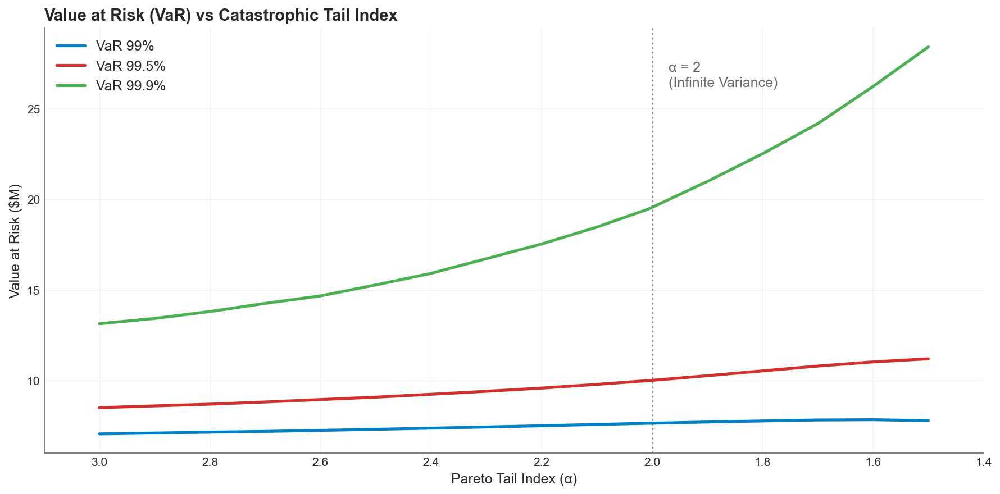
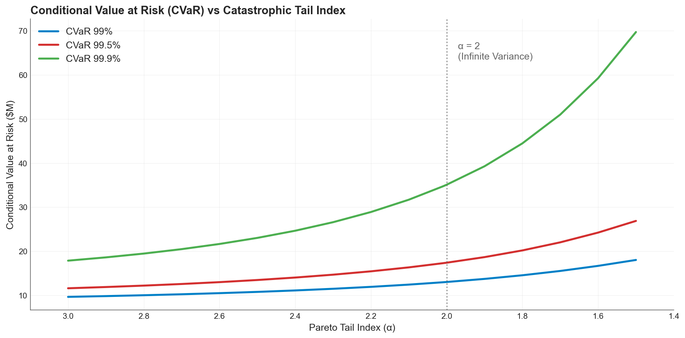
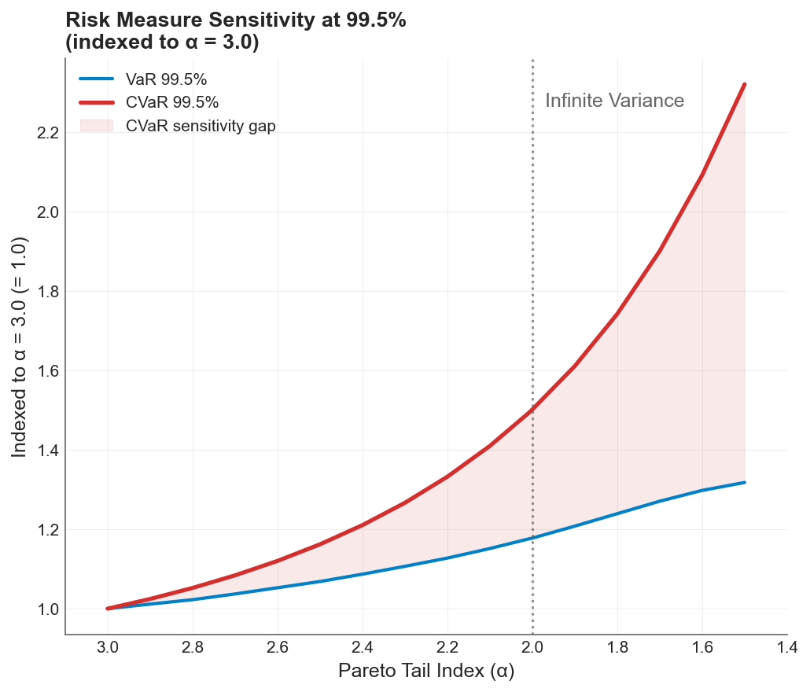

I stressed a loss distribution until its variance became infinite, but the industry-standard risk metric barely noticed.

The experiment is simple: take a compound Poisson loss model, hold expected losses constant, and vary only the catastrophic tail shape from well-behaved (Pareto $\alpha = 3.0$) to extreme ($\alpha = 1.5$), where variance ceases to exist as a finite quantity. Then compare what two standard risk measures have to say about the changing hazards.

Value at Risk (VaR) at 99.5% increased by a factor of 1.3x.

Conditional Tail Expectation (CTE) at the same level more than doubled at 2.3x.

That gap is the subject of this post, and it has direct consequences for how companies should think about [volatility drag, premium drag](volatility-drag-vs-premium-drag.md), and the insurance decisions that manage both.

## What VaR and CTE Actually Measure

VaR at a confidence level $p$ answers the question: *what is the loss threshold you won't exceed in $p\%$ of years?* It is a single quantile, a point on the distribution. VaR at 99.5% is the loss level exceeded only once in 200 years on average.

CTE (also called CVaR [Conditional Value at Risk], TVaR [Tail Value at Risk], or Expected Shortfall) at the same level answers a different question: *given that you've exceeded the VaR threshold, how bad is it on average?* CTE averages everything beyond the quantile.

The distinction is subtle but critical. VaR tells you *how often* you're in trouble. CTE tells you *how deep* the trouble runs when it arrives.

For well-behaved distributions, the two measures track each other proportionally. For heavy-tailed distributions, they diverge. The experiment below quantifies exactly how much.

## The Experiment

I simulated one million annual loss scenarios using a three-component compound Poisson model:

- **Attritional losses**: Lognormal severity, ~5 claims/year
- **Large losses**: Lognormal severity, ~1.75 claims/year
- **Catastrophic losses**: Pareto severity, ~0.15 events/year

The catastrophic component is where the action is. I swept the Pareto tail index $\alpha$ across 17 values from 3.0 down to 1.5, adjusting the Pareto scale parameter $x_m$ at each step so that the expected catastrophic loss remained constant:

$$E[X_{\text{cat}}] = \frac{\alpha \cdot x_m}{\alpha - 1} = \text{constant}$$

This is important. Nothing about the average loss changes. The expected annual aggregate stays at ~\$1.15M throughout. Only the shape of the tail changes, concentrating more probability mass in extreme outcomes as $\alpha$ decreases.

The critical transition occurs at $\alpha = 2$. Above this threshold, the Pareto distribution has finite variance. Below it, variance diverges to infinity while the mean remains well-defined. This isn't an abstract mathematical curiosity. It means the standard deviation of your loss experience becomes undefined, sample estimates of variance never converge, and any risk metric that depends on variance breaks down.

All simulations used common random numbers, meaning identical Poisson counts and uniform draws were reused across $\alpha$ values. Every difference in the results is attributable solely to the tail shape.

## How VaR Responds


*VaR at three confidence levels as the Pareto tail index decreases (heavier tails to the right). All three curves rise modestly. Even VaR 99.9% roughly doubles, while VaR 99% barely moves.*

VaR increases across all confidence levels as the tail thickens, but the response is muted. At the Solvency II standard of 99.5%, VaR rises from \$8.5M to \$11.2M, a 1.3x increase. At 99%, VaR increases by only 1.1x. Even at 99.9%, the increase is around 2.2x.

The flatness of the lower confidence curves is striking. A portfolio can cross from finite to infinite variance, and VaR 99% reports a 10% increase. The quantile is structurally insensitive to what happens beyond it.

## How CTE Responds


*CTE at the same three confidence levels. The curves are dramatically steeper, particularly at 99.9% where CTE nearly quadruples from \$18M to \$70M.*

CTE tells a different story. At 99.5%, CTE rises from \$11.6M to \$26.9M, a 2.3x increase. At 99.9%, CTE nearly quadruples from \$17.9M to \$69.7M. At 99%, CTE almost doubles.

The divergence accelerates past $\alpha = 2$. Once variance becomes infinite, the conditional average in the tail starts capturing loss realizations that grow without bound. CTE registers this; VaR does not.

## The Sensitivity Gap


*Both measures indexed to their $\alpha = 3.0$ baseline at the 99.5% confidence level. The shaded region is the sensitivity gap: the tail risk that VaR structurally cannot detect. By $\alpha = 1.5$, CTE has grown 2.3x while VaR has grown only 1.3x.*

When both measures are indexed to their well-behaved baselines, the gap becomes visible. At $\alpha = 3.0$, VaR and CTE start at the same index of 1.0. As the tail thickens, CTE pulls away. The shaded region between the curves represents tail risk that VaR is structurally blind to.

The CTE/VaR ratio, which measures how much deeper the average tail loss runs beyond the threshold, increases from 1.36 at $\alpha = 3.0$ to 2.40 at $\alpha = 1.5$. In the well-behaved regime, tail losses average 36% beyond VaR. In the infinite-variance regime, they average 140% beyond VaR.

One observation worth flagging: at very low $\alpha$, VaR at 99% actually *decreases* slightly even as CTE continues to climb. This happens because the Pareto minimum $x_m$ drops as $\alpha$ decreases (to maintain constant mean), pulling the quantile leftward even as the tail mass intensifies above it. CTE captures this intensification. VaR misses it entirely.

## Connection to the Two Drags

In the [previous post](volatility-drag-vs-premium-drag.md), I decomposed time-average growth into two opposing forces:

$$g \approx \mu_{\text{arith}} - \frac{\sigma^2}{2}$$

**Premium drag** reduces the arithmetic mean $\mu$ through the direct cost of insurance. **Volatility drag** penalizes growth through $\sigma^2/2$, the quadratic penalty that separates geometric from arithmetic compounding. The optimal deductible sits where the marginal premium savings from retaining more risk exactly equal the marginal volatility cost.

The VaR vs CTE comparison reveals which risk measure actually captures the force that matters most for long-term compounding.

Volatility drag is driven by the *magnitude* of retained losses. It is the size of the hits to equity, not just their frequency, that inflates $\sigma^2$ and penalizes compounding growth. VaR, as a pure quantile, is structurally blind to magnitude. It tells you how often losses exceed a threshold, but nothing about how bad they are when they do. CTE responds directly to loss severity in the tail.

When the catastrophic tail thickens from $\alpha = 3.0$ to $\alpha = 1.5$:

- VaR increases by 1.3x. It detects a modest shift in the quantile, but misses the redistribution of mass above it.
- CTE more than doubles at 2.3x. It captures the growing severity that drives the $\sigma^2/2$ penalty on compounding growth.

A risk manager relying solely on VaR would see a 30% increase in the 99.5th percentile loss and might conclude the program needs modest adjustment. CTE reveals the actual exposure: the average loss *conditional on being in the tail* has more than doubled, which means the volatility drag on long-term compounding has intensified far more than the VaR signal implies.

## Why This Matters for Insurance Decisions

Under multiplicative dynamics, a 50% loss followed by a 50% gain doesn't bring you back to even. It leaves you at 75%. This is the ergodic insight that underpins the entire [framework](insurance-limit-selection-through-ergodicity-when-the-99p9th-percentile-isnt-enough.md): companies don't operate across ensembles, they operate in time, and in time, variance compounds against you.

CTE is the risk measure that captures this compounding cost. When you're evaluating whether to buy higher limits or accept a lower deductible, the relevant question is not "how often will I breach this threshold?" but "when I breach it, how much capital do I lose, and what does that do to my growth trajectory over the next 25 years?"

Consider a company sitting at $\alpha \approx 2.0$, right at the boundary of finite variance. The CTE/VaR ratio is already 1.7x, meaning the average tail loss is 70% larger than what VaR reports as the threshold. If that company's risk environment shifts even modestly toward heavier tails (through climate exposure, cyber accumulation, or evolving litigation trends), the conditional severity grows explosively while VaR barely registers the change.

This asymmetry has a direct implication for the volatility drag calculation. The $\sigma^2/2$ penalty depends on the variance of equity returns, and that variance is dominated by the conditional severity in the tail, not the frequency of tail entry. A company using VaR to calibrate its insurance program will systematically under-hedge the volatility drag, accepting a growth penalty it cannot see in its risk metrics.

## The Regulatory Mismatch

Solvency II, the regulatory framework governing European insurance, is calibrated on VaR at 99.5%. The results above show that at this confidence level, VaR increases 1.3x while CTE increases 2.3x as the tail index crosses the critical $\alpha = 2$ boundary. Regulators relying on VaR are systematically under-counting the growing conditional severity.

This isn't a theoretical concern. Climate risk, cyber accumulation, and pandemic exposure are all plausible mechanisms that could push catastrophic loss distributions from $\alpha > 2$ (manageable variance) to $\alpha < 2$ (infinite variance). If the industry's risk metrics can't detect the shift, capital adequacy frameworks will lag reality.

Regulators are starting to shift to CTE, and there are good reasons for that.

## Practical Takeaways

**If you're calibrating insurance limits:** Use CTE, not VaR, to evaluate tail adequacy. VaR tells you where the tail starts. CTE tells you what happens inside it, and that's what drives the volatility drag on your company's long-term growth.

**If you're evaluating deductible levels:** The [volatility drag vs premium drag](volatility-drag-vs-premium-drag.md) tradeoff depends on accurate measurement of the variance your retained losses create. VaR-based estimates will understate this variance, particularly if your catastrophic loss distribution has $\alpha$ near or below 2.

**If you're uncertain about your tail shape:** This is the most common situation. Historical data rarely contains enough extreme events to distinguish $\alpha = 2.5$ from $\alpha = 1.8$, yet the CTE at 99.5% differs by a factor of 1.7x between these two assumptions. The [stochastic tail analysis](stochasticizing-tail-risk.md) in this series addresses exactly this problem by treating the tail shape as uncertain and exploring the full space of outcomes.

**If you're building risk models:** VaR lets you sleep at night. CTE is what actually keeps you safe.

## Download the Code

The full analysis, including all simulation parameters and diagnostic plots, is available in the notebook:

- [Jupyter Notebook — Risk Measures Under Catastrophic Tail Variation: VaR vs CTE](https://github.com/AlexFiliakov/Ergodic-Insurance-Limits/blob/main/ergodic_insurance/notebooks/reconciliation/13_risk_measures_compare.ipynb)

**Install the Framework**:

```python
!pip install --user --upgrade --force-reinstall ergodic-insurance
```
