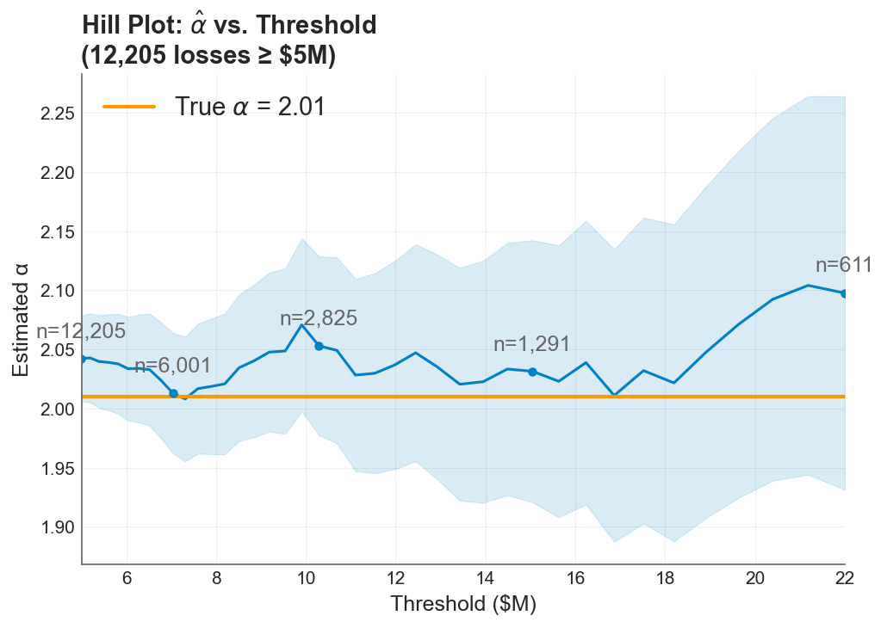
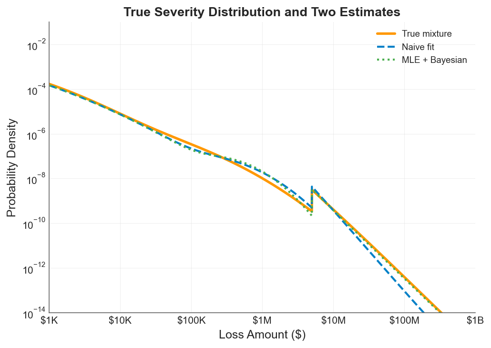
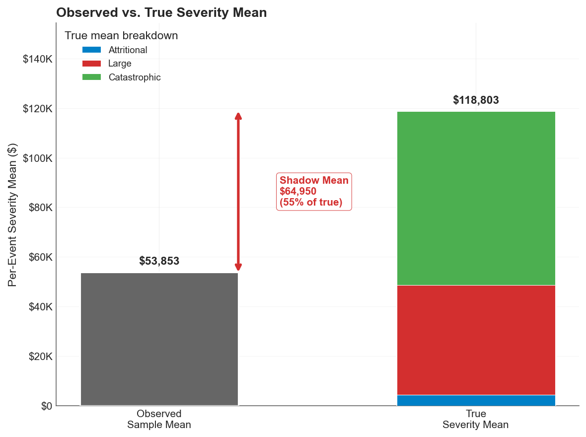

Your company has five years of loss history. In those five years, you've seen plenty of attritional claims, a handful of large losses, and maybe one or two events that made someone in the C-suite lose sleep. From this data, your actuary fits a severity distribution, prices your insurance tower, and everyone moves on.

But there's a problem. The distribution you fitted describes the losses you've *seen*. It says almost nothing about the losses you haven't. And in insurance, the losses you haven't seen are the ones that matter most.

Nassim Taleb calls this gap the **shadow mean**: the difference between the true expected value of a heavy-tailed distribution and the expected value you'd estimate from a finite sample. With five years of data and a Pareto-tailed severity curve, the shadow mean isn't a rounding error. It can be the majority of the true mean, hiding silently in the tail where your data doesn't reach.

This post explores how that shadow emerges, why naive estimation misses it, and what you can do about it using Maximum Likelihood Estimation with industry data to recover the true aggregate distribution.

## The Problem With Observed Averages

As actuaries and risk managers, we should base our loss profiles on the underlying risk structure. Instead, we often settle for deriving our understanding from observed averages.

This works well enough for attritional losses. If you've seen 50 slip-and-fall claims averaging \$40K each, the lognormal fit is stable, the mean is reliable, and the tail is light enough that what you've seen is representative of what you'll see.

It breaks down completely for catastrophic losses. With a Pareto tail index near $\alpha = 2$ and a frequency of 0.08 events per year, your company might go 12 or more years between catastrophic losses. Five years of history is overwhelmingly likely to contain zero or one such events. Fitting to that sample is like estimating ocean depth from a puddle.

The shadow mean quantifies this blindness. For a Pareto distribution with tail index $\alpha$ and scale parameter $x_m$, the true mean is:

$$E[X] = \frac{\alpha \cdot x_m}{\alpha - 1}$$

But the sample mean from a small number of observations converges slowly, particularly when $\alpha$ is close to 2 where variance is barely finite (or, as we explored in the [risk measures analysis](risk-measures-under-cat-tail.md), doesn't exist at all). The shadow mean is the expected value of what's missing: the integral of the density function beyond the largest observation in your sample, weighted by magnitude.

For the distributions in this experiment, the shadow is large. A naive estimator effectively assumes the tail ends where the data ends. The true distribution keeps going.

## The Experiment

I simulated a realistic data environment for a middle-market manufacturing company:

- **5 years of company-specific loss history**, drawn from a three-component compound Poisson model (attritional, large, and catastrophic claims)
- **15 years of related industry catastrophic data**, representing the kind of supplemental information available through industry loss databases for losses above \$5M

The true underlying severity model uses:

| Component | Frequency | Severity | Weight |
|---|---|---|---|
| Attritional | 10.0/year | Lognormal (mean \$5K, CV=8) | 88.3% |
| Large | 1.25/year | Lognormal (mean \$400K, CV=4) | 11.0% |
| Catastrophic | 0.08/year | Pareto ($\alpha$=2.01, $x_m$=\$5M) | 0.7% |

The catastrophic component is critical. At $\alpha = 2.01$, we're just barely in the regime where variance is finite. The true expected catastrophic severity is approximately:

$$E[X_{cat}] = \frac{2.01 \times \$5M}{2.01 - 1} = \$9.95M$$

But in a 5-year sample with 0.08 events per year, you expect to see 0.4 catastrophic claims total. Most samples will contain zero. The few that contain one will anchor the estimate to a single realization, which could be \$6M or \$60M depending on the draw. Neither tells you much about the true mean.

This is where the industry data becomes essential. Fifteen years of catastrophic observations from similar companies provides a much richer sample of the tail, even though it comes from a different (related) population.

## Two Approaches to Estimation

I compared two estimation strategies against the true distribution:

**The Naive Approach:** Fit the mixture distribution to the observed sample mean and variance from the 5-year company history. This is essentially what happens when you calibrate a severity model to your own loss experience without supplementing it with external data or structural assumptions about the tail.

**The MLE + Bayesian Approach:** Use Maximum Likelihood Estimation, specifically the Hill estimator, to estimate the Pareto tail index from the combined company and industry catastrophic data. The Hill estimator is purpose-built for this problem: given a sample of observations believed to follow a power law in the tail, it estimates the tail index $\alpha$ by:

$$\hat{\alpha}_{Hill} = \left[\frac{1}{k} \sum_{i=1}^{k} \ln \frac{X_{(n-i+1)}}{X_{(n-k)}}\right]^{-1}$$

where $X_{(1)} \leq \ldots \leq X_{(n)}$ are the order statistics and $k$ is the number of upper-order statistics used. The estimator works with a rough Bayesian prior on the tail index to regularize the estimate when data is sparse.


*The Hill estimator hovers near the true tail index as more industry observations are included, despite a rough Bayesian prior.*

## The Result


*The true mixture distribution (orange line) against the naive fit (blue dashed) and the MLE + Bayesian estimate (green dotted). The gap between the blue and orange lines in the tail is the shadow mean: probability mass the naive approach cannot see. The MLE approach tracks the true distribution deep into the tail.*

The chart tells the whole story. On a log-log scale spanning from \$1K to \$1B:

- **Below \$100K**, all three curves overlap. The body of the distribution is well-sampled and easy to estimate. This is where most of your claims live, and any reasonable method gets it right.

- **From \$100K to \$2M**, the naive fit (blue dashed) begins to diverge. It slightly overestimates density in this range because it's compensating, fitting a distribution that needs to match the observed mean while being structurally unable to place enough mass in the far tail.

- **Above \$2M**, the shadow opens. The naive approach drops off steeply because it has no structural basis for maintaining heavy-tailed behavior beyond the range of observed data. The true distribution (orange) keeps producing meaningful probability density out to \$100M and beyond.

- **The MLE + Bayesian estimate** (green dotted) tracks the true distribution remarkably well through the entire range. By estimating the tail index from the combined dataset and using the Pareto structure to extrapolate, it recovers the probability mass that the naive approach misses.

The shadow mean virtually disappears under the MLE approach. In this example, that's the difference between a tower built on guesswork and one built on a defensible structure.

## Why the Shadow Mean Matters for Insurance Decisions

The shadow mean isn't just a statistical curiosity. It has direct consequences for every topic in this series.

**For insurance pricing:** The naive approach underestimates the expected loss in the tail, which means the Limited Expected Value (LEV) at high attachment points is biased downward. Excess layers look cheaper than they should, and the insured (or their actuary) underestimates the value of high limits. This connects directly to the [insurance cliff](insurance-cliff-by-risk-profile.md): if your severity model has a shadow mean, you're standing closer to the cliff edge than you think.

**For volatility drag:** The [premium drag vs volatility drag tradeoff](volatility-drag-vs-premium-drag.md) depends on accurately measuring the variance that retained losses create. If your severity estimate misses the tail, your variance estimate is biased downward, which means you underestimate the $\sigma^2/2$ penalty on compounding growth. The optimal deductible shifts because you can't see the full cost of retained risk.

**For risk measures:** We showed in the [VaR vs CTE analysis](risk-measures-under-cat-tail.md) that CTE is far more sensitive to tail severity than VaR. But both metrics are only as good as the distribution you feed them. A naive severity model produces a CTE that's biased low precisely in the region where it matters most. The [expectile analysis](exploring-expectiles.md) faces the same dependency: the expectile's advantage in magnitude sensitivity is wasted if the magnitude is wrong.

**For the ergodic framework broadly:** The entire [ergodic insurance optimization](insurance-limit-selection-through-ergodicity-when-the-99p9th-percentile-isnt-enough.md) rests on accurately modeling what happens when rare, severe losses hit a company's balance sheet over multi-decade horizons. If your severity distribution has a shadow mean, your simulation underestimates the severity of the tail events that drive ruin, understates the value of insurance limits, and produces an optimistic growth trajectory that real companies won't achieve.

## Practical Implications

**Supplement company data with industry data.** Five years of company-specific history is insufficient to calibrate the catastrophic tail. Industry databases, reinsurer benchmarks, and catastrophe model outputs provide the additional observations needed to estimate the tail index. The Hill estimator and similar methods are designed for exactly this situation: combining sparse but relevant external data with limited internal experience.

**Use structural assumptions about the tail.** The Pareto distribution isn't arbitrary; it's the natural limiting form for loss exceedances above a high threshold, grounded in the same extreme value theory that underpins the [stochastic tail analysis](stochasticizing-tail-risk.md) earlier in this series. Imposing this structure on the tail is not overfitting. It's using the mathematics of extremes to fill in what finite samples cannot.

**Quantify the shadow.** Before you evaluate your next limit, compute the shadow mean of your severity model. Compare the fitted mean against the theoretical mean implied by the estimated tail index. If there's a gap, your insurance program may be calibrated to an optimistic view of reality.

**Be honest about what $\alpha$ near 2 means.** When the tail index is close to 2, you're in the regime where variance is barely finite and sample estimates are unreliable. This isn't an edge case. Many catastrophic loss distributions, including property catastrophe, large liability, and cyber, plausibly live in this neighborhood. The shadow mean grows as $\alpha$ approaches 2, and the naive estimator becomes increasingly dangerous.



*For this company, the shadow mean represents 55% of the true expected aggregate loss, invisible to any model calibrated only to observed experience.*

## The Broader Point

Loss severity estimation is where the rubber meets the road for everything in this series. You can have the right risk measure ([expectiles](exploring-expectiles.md)), the right optimization framework ([ergodic growth rate](volatility-drag-vs-premium-drag.md)), and the right understanding of [tail dynamics](stochasticizing-tail-risk.md)). But if the severity distribution feeding all of those tools has a shadow mean, the outputs inherit that blind spot.

The MLE + Bayesian approach demonstrated here doesn't require exotic methods or massive datasets. It requires a structural model of the tail (Pareto), an estimator designed for heavy-tailed data (Hill), and willingness to look beyond your own loss history. The shadow mean disappears not because the tail becomes less dangerous, but because you've finally measured it.

## Download the Code

The full analysis, including the severity simulation, Hill estimation, naive comparison, and all diagnostic plots, is available in the notebook:

- [Jupyter Notebook — Severity Distribution Estimation](https://github.com/AlexFiliakov/Ergodic-Insurance-Limits/blob/main/ergodic_insurance/notebooks/reconciliation/11_severity_distribution.ipynb)

**Install the Framework**:

```python
!pip install --user --upgrade --force-reinstall ergodic-insurance
```
