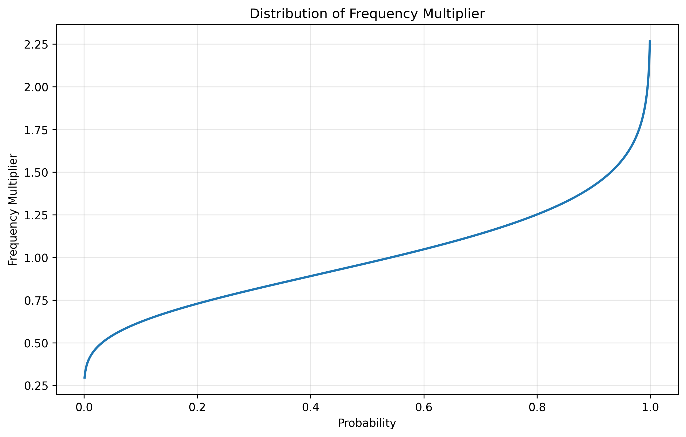
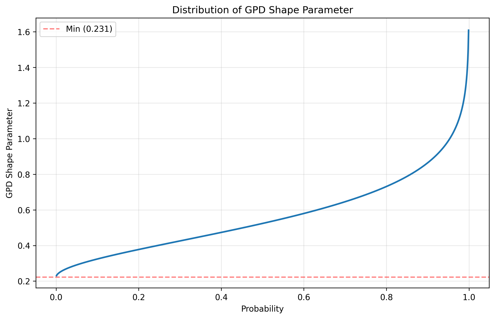
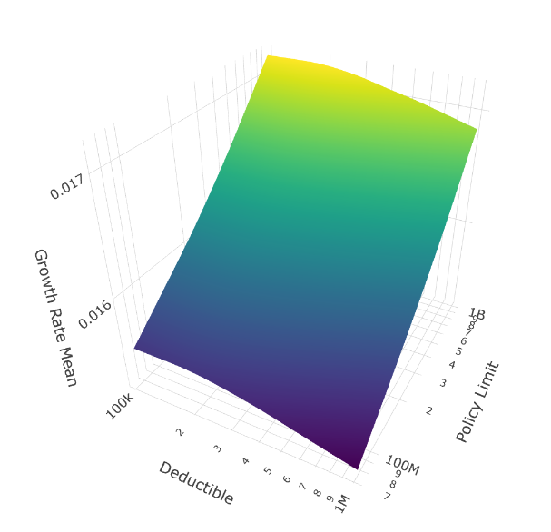
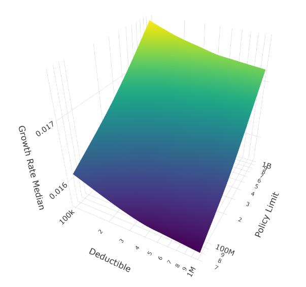
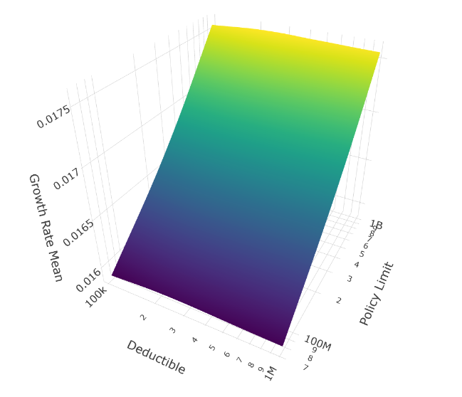
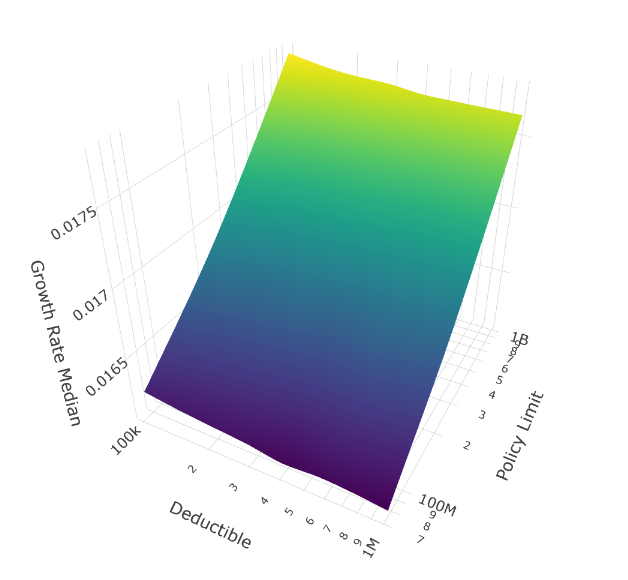
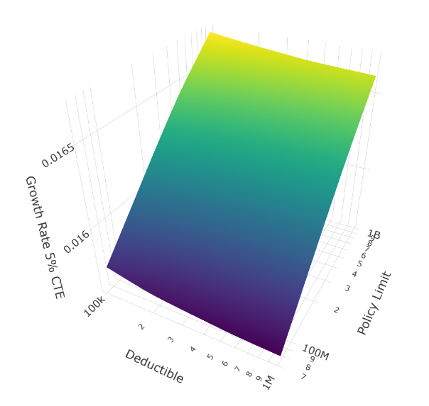

In practice, it's difficult to fit the tail shape of extreme losses to historical data because the data is very sparse. One approach is to make the tail stochastic and explore the resulting outcome space for reasonability. In this article, we study the outcome space of various insurance programs for a simplified company under loss assumptions with stochasticized parameters. We also apply Sobol sequences to increase the rate of convergence.

The setup in this example is inspired by the manufacturing industry, but it should be treaded as merely a demonstration of the software's capabilities, and this article should not be used to make any insurance decisions. Any conclusions reached here for our model company are spurious and not to be taken as conclusive. **All corporate insurance purchasing decisions must be made in the full context of the individual company.**

## Company Configuration

I used the following company assumptions across all simulations:
- Initial Assets: \$75M
- Asset Turnover Ratio: 1.0 (Revenue = Assets * Turnover)
- EBITA Before Claims and Insurance: 10%
- Tax Rate: 25%
- Retention Ratio: 70% (30% dividends)
- PP&E Ratio: 0% (meaning no depreciation expense)

## Loss Configuration

The biggest changes in the configuration setup compared to prior analysis were making two parameters stochastic: a frequency multiplier, which scales the number of average losses experienced in a given year, as well as extreme loss tail shape, which influenced the tail thickness of very large losses.

These two parameters (frequency multiplier and loss tail shape) were scaled at the start of each configuration and held steady across all years and individual simulations.

### Stochastic Frequency Multiplier

The Poisson mean used for the Frequency distributions is converged into a Gamma-distributed random variable via a multiplicative factor. Below is the distribution of the frequency multiplier:

### Loss Distributions

The simulation employs a four-tier loss structure that reflects the reality of corporate risk exposure:
Revenue serves as the exposure base for all loss frequencies, scaling risk with company size.
This four-tier approach captures the full spectrum from routine operational losses to true black swans, excepting loss correlations.
- Attritional Loss Frequency (Poisson): 2.85 * (Frequency Multiplier)
- Attritional Loss Severity (Lognormal): Mean=\$40K with Coefficient of Variation (CV)=0.8
- Large Loss Frequency (Poisson): 0.20 * (Frequency Multiplier)
- Large Loss Severity (Lognormal): Mean=\$500K with CV=1.5
- Catastrophic Loss Frequency (Poisson): 0.02 * (Frequency Multiplier)
- Catastrophic Loss (Pareto): Minimum=\$5M with Alpha=2.5
- Extreme Losses are configured to replace extreme losses with a Generalized Pareto Distribution calibrated to match tail percentiles, but with a thicker tail.

### Stochastic Tail Shape Parameter

The tail shape parameter in our results controls tail thickness: lower shape values produce thicker tails with a higher probability of extreme events.
The stochastic setup of the tail parameter is somewhat convoluted and can be found in the implementation Jupyter Notebook, but essentially it represents a plausible range of tail shapes that is unbounded above for stochastic exploration.

_Technical note: this distribution is essentially a Beta distribution made unbounded via the logit function._

## Sobol Sequences for Risk Simulation

> The advantage of using Sobol sequences is faster convergence across all statistics

**Sobol sequences** are quasi-random (low-discrepancy) sequences that systematically fill a multidimensional space more uniformly than standard pseudo-random Monte Carlo draws. In our 2D application, we use Sobol sequences to simultaneously sample uncertainty in both the Poisson frequency multiplier (via a Gamma distribution) and the extreme loss tail shape parameter (via a logit-unbounded Beta distribution). Unlike pseudo-random sampling, which can leave gaps and clusters in the parameter space by chance, Sobol sequences ensure proportional coverage of all regions of the joint distribution from the very first simulations. This property, known as equidistribution, leads to faster convergence of the simulated risk metrics we care about most.

The advantage of using Sobol sequences is faster convergence across all statistics, but particularly for tail risk metrics like the 95th and 99th percentile value at risk (VaR) and conditional tail expectations (CTE) that drive insurance program decisions. In testing, Sobol-based simulations often achieve comparable accuracy to pseudo-random Monte Carlo with 4-10x fewer iterations, reducing runtime substantially when evaluating multiple insurance program structures. More importantly for risk management, the tail estimates are more stable and reproducible at smaller sample sizes, which is critical when presenting results to senior leadership or comparing program alternatives. For our time-average performance analysis, this means we can efficiently explore a wider range of insurance program parameters while maintaining confidence in the extreme scenarios that ultimately determine program adequacy.

## Scenario Configuration

- Deductibles: \$100K, \$250K, \$500K, \$1M
- Policy Limits: \$75M, \$150M, \$250M, \$350M, \$500M, \$1B
- Loss Ratio: steady 60% across all configurations

This yielded 24,576 combinations of insurance programs and pairs of Sobol Sequence parameters.

$$(\text{1024 Sobol Pairs}) * (\text{4 Deductibles}) * (\text{6 Policy Limits}) = 24,576 \text{ configurations}$$

For each configuration, I ran 10,000 simulations for 25 years. Although this is on the low side for production use, this setup ensured I could complete the runs in 24 hours on Google Colab and at a reasonable cost.

## Key Assumptions & Limitations

This framework makes several simplifying assumptions:
- Uniform loss ratios across all insurance layers (reality would show varying margins by layer)
- Perfect insurer knowledge of loss distributions
- Uncorrelated loss events
- Deterministic revenue growth
- No inflation or discounting effects
These simplifications allow us to isolate the ergodic effects of limit selection, but they also mean  these specific results do not generalize directly to real corporate structures. However, the directional insights and underlying mechanisms should transfer to more complex scenarios, and the framework can be adapted to study individual cases.

## Exploring Results

Looking at the results at a high level, it appears that buying the maximum limit is advisable for this specific company and loss configuration.

**Mean Growth Rate Analysis**

Low deductibles and high limits are the theme here. Maximizing coverage.

**Median Growth Rate Analysis**

The median here suggests that the \$100K deductible is clearly favored under this configuration.

**5% Conditional Tail Expectation (CTE) of the Growth Rate**

The CTE contrasts with the median growth rate by clearly favoring the \$250K deductible over the \$100K deductibles in the worst cases, while the median clearly favors retaining more risk via the \$250K deductible.

**Mean Growth Rate Analysis With Thinner Tail**

Next, we reduce the tail thickness significantly by filtering out thick-tailed scenarios, but the results still mostly favor low deductibles and high limits:

Although in this case, the choice of deductibles seems to have little impact on results.

**Median Growth Rate Analysis With Thinner Tail**

**5% CTE of the Growth Rate With Thinner Tail**

Under all evaluations, thin-tailed losses appear to make the deductible irrelevant.

Question: why would that be?

## Source Files

You can explore this setup by downloading the following Jupyter Notebook and the associated Python Script. You need to configure the scenario parameters and increase the number of simulations once you’re satisfied with your setup.

[Jupyter Notebook — Stochastic Tail Simulations](https://github.com/AlexFiliakov/Ergodic-Insurance-Limits/blob/main/ergodic_insurance/notebooks/results_stoch_tail_sim_01/ergodicity_hier_tail_sim_parallel.ipynb)

[Python Script — Company and Loss Configuration](https://github.com/AlexFiliakov/Ergodic-Insurance-Limits/blob/main/ergodic_insurance/notebooks/results_stoch_tail_sim_01/run_hier_tail_sim_colab.py)

You need both of these to run, plus run the following in a virtual environment to get the underlying framework:

`!pip install --user --upgrade --force-reinstall git+https://github.com/AlexFiliakov/Ergodic-Insurance-Limits`

## Read About the Framework

[https://mostlyoptimal.com](https://mostlyoptimal.com/)  contains a high-level overview and the motivation for creating this framework.

[https://mostlyoptimal.com/research](https://mostlyoptimal.com/research)  includes a research paper that describes the framework in some detail.

[https://mostlyoptimal.com/tutorial](https://mostlyoptimal.com/tutorial)  consists of a guide to get started in applying the framework to your specific use cases.
