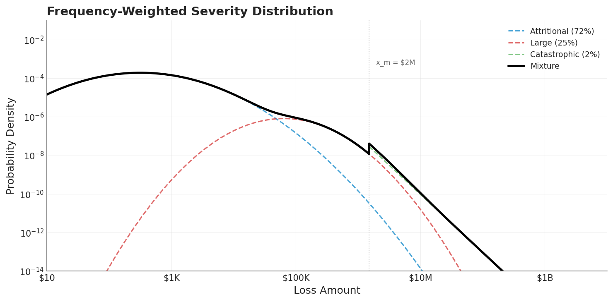
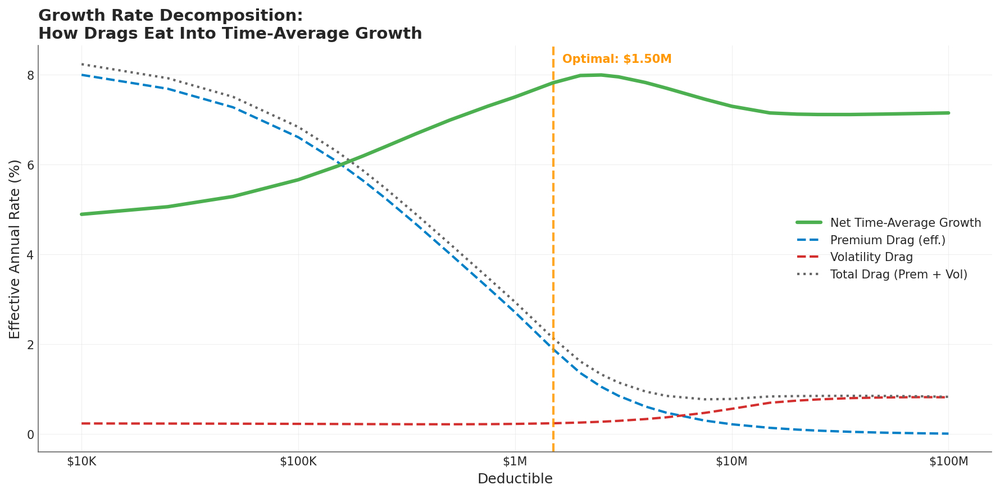
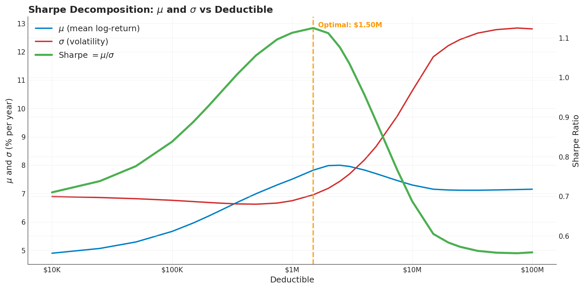

Every insurance buyer faces a fundamental trade-off when choosing a deductible. Pay more premium for lower deductibles and your equity path smooths out, but the cost eats into capital that would otherwise compound. Retain more risk with higher deductibles and you keep premium dollars working, but a bad year can crater your equity base in ways you never fully recover from.

These two forces, **premium drag** and **volatility drag**, pull in opposite directions. Finding the right balance between them is the core problem of deductible optimization. But when I first plotted both drags side by side, something didn't add up.

## The Setup

I modeled a middle-market manufacturing company over 25 years:

- \$10M initial assets, \$17.5M revenue (1.75x asset turnover)
- 15% operating margin before losses (~\$2.6M operating income)
- 50% annual revenue volatility
- \$200M policy limit held constant
- Three-tier loss model: attritional, large, and catastrophic claims

The loss model uses a compound Poisson structure with frequency-weighted severity across three tiers, producing the familiar shape where small losses are frequent and large losses are rare but heavy-tailed.


*The mixture distribution (black) blends attritional (72%), large (25%), and catastrophic (2%) loss components. The vertical line at \$2M marks where catastrophic losses begin to dominate the tail.*

I then swept through 26 deductible levels from \$10K to \$100M, running one million simulated paths at each level using common random numbers (identical loss events and revenue shocks across all deductible choices) so that every difference in outcome is attributable to the insurance structure alone.

## Two Drags, One Growth Rate

Under multiplicative (compounding) dynamics, the time-average growth rate of equity decomposes into a clean tradeoff:

$$g \approx \mu_{\text{arith}} - \frac{\sigma^2}{2}$$

where $\mu_{\text{arith}}$ is the arithmetic mean return and $\sigma^2/2$ is the **volatility drag**, the well-known Kelly penalty that separates geometric from arithmetic growth. Every dollar of variance costs you compounding power.

**Premium drag** works through the numerator. When you pay premium, the after-tax, after-retention cost reduces $\mu$ directly. For this company, only 52.5% of each premium dollar actually drains retained equity (after 25% tax and 30% dividends), so the effective drag is $0.525 \times E[\text{premium}/\text{equity}]$.

**Volatility drag** works through $\sigma^2/2$. When you retain more risk (higher deductible), the variance of your equity returns increases, and the quadratic penalty grows.

The growth rate decomposition across all 26 deductible levels reveals how these two forces interact:


*As the deductible rises (left to right), premium drag (blue dashed line) falls while volatility drag (red dashed) rises. Net time-average growth (green) peaks at the \$1.5M optimal deductible, where the Sharpe ratio is maximized.*

At the low-deductible end, premium drag dominates. A \$10K deductible costs 15.2% of equity annually in premium, producing an effective drag of 800 basis points on the growth rate. Volatility drag is just 24 basis points; negligible by comparison.

At the high-deductible end, the picture inverts. Premium is near zero, but volatility drag has expanded to 82 basis points. Net growth actually *decreases* past the optimum because the volatility penalty grows faster than the premium savings.

The crossover tells you where to set the deductible. At \$1.5M, total drag is minimized and net time-average growth peaks at 7.82%.

## The Part I Missed

If this were the whole story, you might look at the growth rate chart and conclude that volatility drag doesn't matter much. After all, it only swings from 24 to 82 basis points, a 60bps range, while premium drag swings by nearly 800 basis points. Why worry about it?

Because volatility hits you twice.

The Sharpe ratio (risk-adjusted return $\mu/\sigma$) reveals the full cost. Volatility reduces the numerator through $\sigma^2/2$, and it simultaneously inflates the denominator through $\sigma$ itself. A 60 basis point growth penalty sounds small. But the same volatility that causes it also doubles the risk you took to earn that growth.


*The mean log-return $\mu$ (blue) rises with deductible as premium drag falls. But volatility $\sigma$ (red) rises faster above \$1M, collapsing the Sharpe ratio (green) from its peak of 1.13 at the optimal \$1.5M deductible to 0.56 at self-insurance.*

This is the chart that changed my understanding. Look at what happens past the optimum:

- **\$1.5M deductible**: Sharpe = 1.13, growth = 7.82%, ruin = 0.1%
- **\$5M deductible**: Sharpe = 0.89, growth = 7.70%, ruin = 0.1%
- **Self-insured**: Sharpe = 0.57, growth = 7.26%, ruin = 3.5%

The growth rate only drops 56 basis points from optimal to self-insured. But the Sharpe ratio is *cut in half*. That's the hidden syphon: volatility doesn't just drag down returns, it destroys the efficiency of every unit of risk you take.

## Why Insurance Works Even When It's "Unfair"

Insurance premiums are loaded. They include the insurer's profit margin, expenses, and risk charge on top of expected losses. In this model I used a 70% loss ratio, meaning the insured pays roughly 43% more than actuarially fair value for the risk transferred.

By any single-year expected value calculation, buying insurance is a losing bet.

But the optimal deductible still produces a Sharpe ratio of 1.13, nearly double the self-insured baseline of 0.57. The company pays an actuarially "unfair" premium and ends up dramatically better off, measured by risk-adjusted long-term growth.

This is the ergodic insight. Under multiplicative dynamics, the ensemble-average calculation (which says insurance is expensive) and the time-average calculation (which says insurance is efficient) give different answers. Companies don't operate across ensembles. They operate in time. And in time, variance compounds against you.

The math is straightforward: the insurer absorbs loss variance and redistributes it across a diversified portfolio where the law of large numbers applies. The policyholder pays above expected value, but receives a variance reduction that translates into a quadratic growth benefit. As long as the variance reduction is large enough relative to the premium markup, the trade is positive-sum for time-average growth.

## Practical Implications

**The deductible is not a cost decision.** It's a volatility management decision. The optimal deductible sits where the marginal premium savings from raising it exactly equal the marginal increase in volatility cost. Below this point, you're overpaying for smoothness. Above it, you're underinsuring against variance that compounds against you over time.

**Don't evaluate volatility drag in isolation.** The $\sigma^2/2$ term understates the true cost of retained variance because it only captures the numerator effect. The Sharpe ratio captures both channels: the drag on growth *and* the inflation of risk, and it gives a more honest picture of what volatility actually costs.

**Multi-year horizons change the calculus.** In a single renewal year, the premium savings from a high deductible look attractive and the volatility penalty is invisible. Over 25 years of compounding, those small annual variance penalties accumulate into permanently lost growth.

## What This Doesn't Cover

This analysis holds the policy limit constant at \$200M and varies only the deductible. It uses a simplified corporate model with deterministic operating margins, independent loss events, and uniform loss ratios across all insurance layers. These assumptions isolate the drag tradeoff cleanly but don't capture the full complexity of real insurance programs.

For how limits interact with tail uncertainty, see [Insurance Limit Selection Through Ergodicity](insurance-limit-selection-through-ergodicity-when-the-99p9th-percentile-isnt-enough.md). For the cliff-like dynamics of limit adequacy, see [The Insurance Cliff](insurance-cliff-by-risk-profile.md). For stochastic tail analysis using Sobol sequences, see [Stochasticizing Tail Risk](stochasticizing-tail-risk.md).

## Download the Code

The full analysis, including all simulation parameters, mathematical derivations, and diagnostic plots, is available in the notebook:

- [Jupyter Notebook — Volatility Drag vs Premium Drag in Deductible Optimization](https://github.com/AlexFiliakov/Ergodic-Insurance-Limits/blob/main/ergodic_insurance/notebooks/optimization/12_vol_drag_vs_prem_drag.ipynb)

**Install the Framework**:

```python
pip install ergodic-insurance
```
